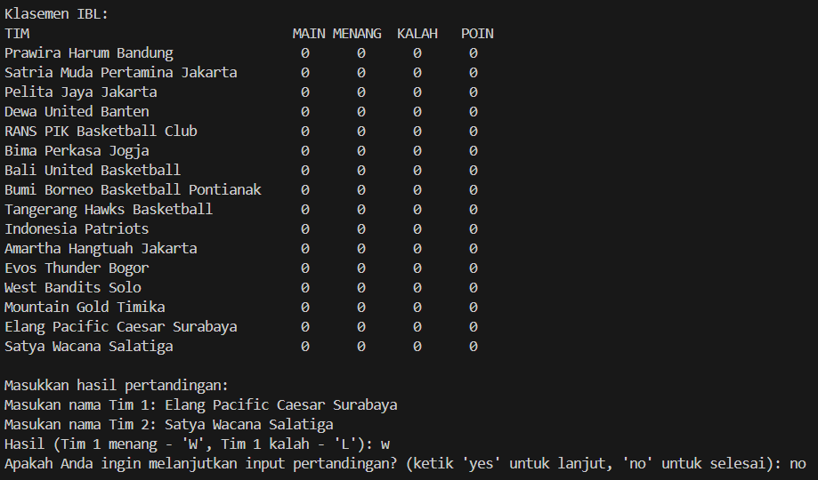
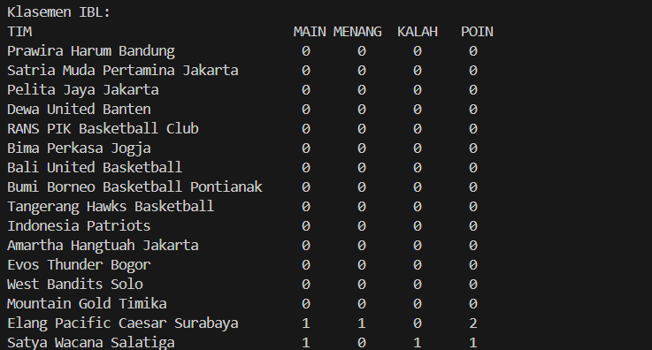

# 
 LAPORAN PRAKTIKUM ALGORITMA DAN STRUKTUR DATA 

## 
 Kuis 2   UTS 

    

    

     

 Nama  : Farhan Mawaludin 

 NIM   : 2341720258 

 Prodi : TEKNIK INFORMATIKA

 Kelas : 1B 

  

# Soal
1. Buat simulasi klasemen berdasarkan kasus dan struktur data yang diminta sesuai
pembagian per mahasiswa! Harap proses penghitungan klasemen telah dipelajari
sehingga soal yang dikerjakan sesuai dengan kasus nyata!
2. Harus berbasis obyek, tidak diperbolehkan menggunakan pendekatan
procedural! 

#### 11 2341720258 FARHAN MAWALUDIN Liga Bola Basket Indonesia -IBL Linked List
<b>Terdapat 4 kelas yaitu kelas Node, Kelas Tim, kelas LinkeddListTim, dan kelas Main</b>

- Kelas Node mempresentasikan elemen dalam linkedlist  yang menyimpan objek tim dan referensi ke elemen berikutnya.

- Kelas Tim merepresentasikan sebuah tim basket. Kelas ini memiliki atribut untuk menyimpan nama tim, jumlah pertandingan yang dimainkan, total kemenangan, total kekalahan, dan poin yang diperoleh. Konstruktor Tim menginisialisasi nama tim dan menyetel atribut lainnya ke 0. Metode catatPertandingan memperbarui statistik berdasarkan hasil pertandingan: menambah jumlah pertandingan, kemenangan atau kekalahan, dan poin (2 poin untuk menang, 1 poin untuk kalah).

- Kelas LinkedListTim menyediakan struktur data yang efisien untuk mengelola informasi tim dalam kompetisi. Ini memungkinkan penambahan, pencarian, pengurutan, dan pencetakan tim dengan mudah.

- Kelas Main digunakan untuk mensimulasikan dari kelas kelas sebelumnya

 <b>Output</b> 

