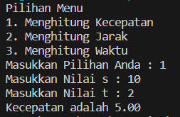
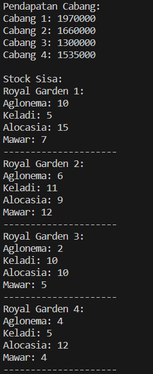

# 
 LAPORAN PRAKTIKUM ALGORITMA DAN STRUKTUR DATA 

    

    

     

 Nama  : Farhan Mawaludin 

 NIM   : 2341720258 

 Prodi : TEKNIK INFOMATIKA

 Kelas : 1B 

  

## 2.1 Percobaan 1: Deklarasi Class, Atribut dan Method 

<h5>2.1.1 SS PRAKTIKUM 1</h5>

 

<h5>2.1.2 SS VERIFIKASI HASIL PERCOBAAN</h5>

 

<h2>Pertanyaan</h2>

1. Sebutkan dua karakteristik class atau object! 
   jawab : karakteristik Atribut yang dimiliki oleh objek dari kelas tersebut.sedangkan Method ini merepresentasikan perilaku atau tindakan yang dapat dilakukan oleh objek dari kelas tersebut.
2. Perhatikan class Buku pada Praktikum 1 tersebut, ada berapa atribut yang dimiliki oleh class
   Buku? Sebutkan apa saja atributnya! 
   Jawab : Pada class buku terdapat 5 atribut yaitu judul (String),pengarang (String),halaman (int),stok (int),harga (int).
3. Ada berapa method yang dimiliki oleh class tersebut? Sebutkan apa saja methodnya! 
   Jawab : Pada class buku terdapat 4 method yaitu tampilInformasi(), terjual(int jml), restock(int jml), gantiHarga(int hrg)
4. Perhatikan method terjual() yang terdapat di dalam class Buku. Modifikasi isi method tersebut
   sehingga proses pengurangan hanya dapat dilakukan jika stok masih ada (lebih besar dari 0)! 
   Jawab:  
5. Menurut Anda, mengapa method restock() mempunyai satu parameter berupa bilangan int? 
6. Commit dan push kode program ke Github
