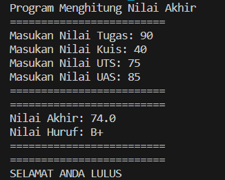
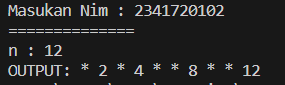
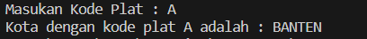
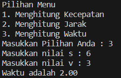

# <p align ="center"> LAPORAN PRAKTIKUM ALGORITMA DAN STRUKTUR DATA </p>

## <p align ="center"> PERTEMUAN 1 <br> KONSEP DASAR PEMROGRAMAN </p>

<br><br><br><br>

<p align="center">
    </p>

<br><br><br><br><br>

<p align = "center"> Nama  : Farhan Mawaludin </p>
<p align = "center"> NIM   : 2341720258 </p>
<p align = "center"> Prodi : TEKNIK INFORMATIKA</p>
<p align = "center"> Kelas : 1B </p>
<br><br>

# 2. Praktikum

## 2.1 Pemilihan

### 2.2.1 Praktikum Pemilihan

```java
import java.util.Scanner;

public class pemilihan11{
    public static void main(String[] args) {
        Scanner input11 = new Scanner(System.in);

        System.out.println("Program Menghitung Nilai Akhir");
        System.out.println("=========================");

        System.out.print("Masukan Nilai Tugas: ");
        int nilaiTugas = input11.nextInt();

        System.out.print("Masukan Nilai Kuis: ");
        int nilaiKuis=input11.nextInt();

        System.out.print("Masukan Nilai UTS: ");
        int NilaiUTS=input11.nextInt();

        System.out.print("Masukan Nilai UAS: ");
        int nilaiUAS=input11.nextInt();

        if (nilaiTugas >= 0 && nilaiTugas <= 100
                && nilaiKuis >= 0 && nilaiKuis <= 100
                && NilaiUTS >= 0 && NilaiUTS <= 100
                && nilaiUAS >= 0 && nilaiUAS <= 100) {


            double nilaiAkhir = 0.2 * nilaiTugas + 0.2 * nilaiKuis + 0.3 * NilaiUTS + 0.3 * nilaiUAS;
            String nilaiHuruf;
            if (nilaiAkhir >= 80) {
                nilaiHuruf = "A";
            } else if (nilaiAkhir >= 73) {
                nilaiHuruf = "B+";
            } else if (nilaiAkhir >= 65) {
                nilaiHuruf = "B";
            } else if (nilaiAkhir >= 60) {
                nilaiHuruf = "C+";
            } else if (nilaiAkhir >= 50) {
                nilaiHuruf = "C";
            } else if(nilaiAkhir > 39) {
                nilaiHuruf = "D";
            } else {
                nilaiHuruf = "E";
            }
            System.out.println("=========================");
            System.out.println("=========================");
            System.out.println("Nilai Akhir: " + nilaiAkhir);
            System.out.println("Nilai Huruf: " + nilaiHuruf);
            System.out.println("=========================");
            System.out.println("=========================");


            if (nilaiAkhir >= 60) {
                System.out.println("SELAMAT ANDA LULUS");
            } else {
                System.out.println("ANDA TIDAK LULUS");
            }

        } else {
            System.out.println("=========================");
            System.out.println("=========================");
            System.out.println("Nilai tidak valid.");
            System.out.println("=========================");
            System.out.println("=========================");
        }
    }
}

```

### Output

 <br> <br> 

## 2.2 Perulangan

### 2.3.2 Praktikum Perulangan

```java
import java.util.Scanner;
public class perulangan11 {
    public static void main(String[] args) {
        Scanner input11 = new Scanner (System.in);

        System.out.print("Masukan Nim : ");
        String nim=input11.nextLine();

        int n = Integer.parseInt(nim.substring(nim.length() - 2));


        if (n < 10) {
            n += 10;
        }
        System.out.println("==============");
        System.out.println("n : " + n);
        System.out.print("OUTPUT: ");

        for (int i = 1; i <= n; i++) {
            if (i != 6 && i != 10) {
                if (i % 2 == 0) {
                    System.out.print(i + " ");
                } else {
                    System.out.print("* ");
                }
            }
        }
    }
}
```

### Output



## 2.3 Array

### 2.4.1 Praktikum Array

```java
import java.util.Scanner;

public class array11 {
    public static void main(String[] args) {

        Scanner input = new Scanner(System.in);

        String[] matkul = { "Pancasila", "Konsep Teknologi Informasi", "Critical Thinking dan Problem Solving",
                "Matematika Dasar", "Bahasa Inggris", "Dasar Pemrograman", "Praktikum Dasar Pemrograman",
                "Keselamatan dan Kesehatan Kerja" };
        int i = 0;
        int j = 0;
        int[] nilai = new int[matkul.length];
        String[] nilaiHuruf = new String[matkul.length];
        double[] nilaiAngka = new double[matkul.length];
        double[] sks = {2,2,2,3,2,2,3,2};

        // Array untuk konversi nilai
        String[] huruf = { "A", "B+", "B", "C+", "C", "D", "E" };
        double[] angka = { 4.0, 3.5, 3.0, 2.5, 2.0, 1.0, 0.0 };
        int[] nilaiBawah = { 80, 73, 65, 60, 50, 39, 0 };
        int[] nilaiAtas = { 100, 80, 73, 65, 60, 50, 39 };

        // Input nilai
        System.out.println("================================================================");
        System.out.println("Program Menghitung IP Semester");
        System.out.println("================================================================");
        for (i = 0; i < matkul.length; i++) {
            System.out.print("Masukkan nilai angka untuk MK " + matkul[i] + ": ");
            nilai[i] = input.nextInt();


            // Validasi nilai
            while (nilai[i] < 0 || nilai[i] > 100) {
                System.out.println("Maaf, nilai tidak valid! Masukkan nilai antara 0 dan 100: ");
                nilai[i] = input.nextInt();
            }
        }

        for (i = 0; i < matkul.length; i++) {
            int indexHuruf = 0;
            for (j = 0; j < nilaiBawah.length; j++) {
                if (nilai[i] > nilaiBawah[j] && nilai[i] <= nilaiAtas[j]) {
                    indexHuruf = j;
                    break;
                }
            }
            nilaiHuruf[i] = huruf[indexHuruf];
        }
        for (i = 0; i < matkul.length; i++) {
            int indexAngka = 0;
            for (j = 0; j < nilaiBawah.length; j++) {
                if (nilai[i] > nilaiBawah[j] && nilai[i] <= nilaiAtas[j]) {
                    indexAngka = j;
                    break;
                }
            }
            nilaiAngka[i] = angka[indexAngka];
        }

        // Menampilkan hasil
        System.out.println("================================================================");
        System.out.println("HASIL KONVERSI NILAI");
        System.out.println("================================================================");
        System.out.printf("%-40s%-14s%-14s%-14s\n", "Mata Kuliah", "Nilai", "Huruf", "Nilai Setara");
        for (i = 0; i < matkul.length; i++) {
            System.out.printf("%-40s%-14d%-14s%-14.2f\n", matkul[i], nilai[i], nilaiHuruf[i], nilaiAngka[i]);
        }
        double totalNilai = 0;
        int totalSks = 0;
        for (i = 0; i < matkul.length; i++) {
            totalNilai += nilaiAngka[i] * sks[i];
            totalSks += sks[i];
        }

        double ipSemester = totalNilai / totalSks;

        System.out.println("================================================================");
        System.out.printf("IP Semester: %.2f\n", ipSemester);
        System.out.println("================================================================");
    }
}

```

### Output


## Fungsi

### Praktikum Fungsi

```java


public class fungsi11 {
    public static void main(String[] args) {
        int[][] stockBunga = {
                { 10, 5, 15, 7 },
                { 6, 11, 9, 12 },
                { 2, 10, 10, 5 },
                { 5, 7, 12, 9 }
        };

        int[] hargaBunga = { 75000, 50000, 60000, 10000 };

        int[] pendapatanCabang = hitungPendapatan(stockBunga, hargaBunga);


        System.out.println("Pendapatan Cabang:");
        for (int i = 0; i < pendapatanCabang.length; i++) {
            System.out.println("Cabang " + (i + 1) + ": " + pendapatanCabang[i]);
        }


        stockBunga[3][0] -= 1;
        stockBunga[3][1] -= 2;
        // Alocasia tidak diubah
        stockBunga[3][3] -= 5;


        String[] jenisBunga = { "Aglonema", "Keladi", "Alocasia", "Mawar" };
        System.out.println("\nStock Sisa:");
        for (int i = 0; i < stockBunga.length; i++) {
            System.out.println("Royal Garden " + (i + 1) + ":");
            for (int j = 0; j < jenisBunga.length; j++) {
                System.out.println(jenisBunga[j] + ": " + stockBunga[i][j]);
            }
            System.out.println("---------------------");
        }
    }

    public static int[] hitungPendapatan(int[][] stockBunga, int[] hargaBunga) {
        int[] pendapatanCabang = new int[stockBunga.length];

        for (int i = 0; i < stockBunga.length; i++) {
            int totalPendapatanCabang = 0;
            for (int j = 0; j < stockBunga[i].length; j++) {
                totalPendapatanCabang += stockBunga[i][j] * hargaBunga[j];
            }
            pendapatanCabang[i] = totalPendapatanCabang;
        }

        return pendapatanCabang;
    }
}
```

### Output


# TUGAS

## 1. Kode Program Soal 1

```java
import java.util.Scanner;
public class tugas111 {
    public static void main(String[] args) {
        Scanner input11=new Scanner(System.in);

        char[] kode = { 'A', 'B', 'D', 'E', 'F', 'G', 'H', 'L', 'N','T' };
        String[][] kota = {{"BANTEN","JAKARTA","BANDUNG","CIREBON","BOGOR","PEKALONGAN","SEMARANG","SURABAYA","MALANG","TEGAL"}};

        System.out.print("Masukan Kode Plat : ");
        char  plat = input11.next().charAt(0);

        int index = -1;
        for (int i = 0; i < kode.length; i++) {
            if (plat == kode[i]) {
                index = i;
                break;
            }
        }

        if (index != -1) {
            System.out.print("Kota dengan kode plat " + plat + " adalah : " );
            for (int j = 0; j < kota.length; j++) {
                System.out.println(kota[j][index]);
            }
        } else {
            System.out.println("Kode plat tidak valid.");
        }


    }
}
```

## Output Soal 1



## 2. Kode Program Soal 2

```java
import java.util.Scanner;

public class tugas211 {
    public static void main(String[] args) {
        Scanner input = new Scanner(System.in);

        System.out.println("Pilihan Menu");
        System.out.println("1. Menghitung Kecepatan");
        System.out.println("2. Menghitung Jarak");
        System.out.println("3. Menghitung Waktu");
        System.out.print("Masukkan Pilihan Anda : ");
        int pilihan = input.nextInt();

        switch (pilihan) {
            case 1:
                hitungKecepatan();
                break;

            case 2:
                hitungJarak();
                break;

            case 3:
                hitungWaktu();
                break;

            default:
                System.out.println("Pilihan tidak valid.");
                break;
        }

        input.close();
    }

    static void hitungKecepatan() {
        Scanner input = new Scanner(System.in);

        System.out.print("Masukkan Nilai s : ");
        double s = input.nextDouble();
        System.out.print("Masukkan Nilai t : ");
        double t = input.nextDouble();

        double v = s / t;
        System.out.printf("Kecepatan adalah %.2f", v);

        input.close();
    }

    static void hitungJarak() {
        Scanner input = new Scanner(System.in);

        System.out.print("Masukkan nilai v : ");
        double v = input.nextDouble();
        System.out.print("Masukkan nilai t : ");
        double t = input.nextDouble();

        double s = v * t;
        System.out.printf("Jarak adalah %.2f", s);

        input.close();
    }

    static void hitungWaktu() {
        Scanner input = new Scanner(System.in);

        System.out.print("Masukkan nilai s : ");
        double s = input.nextDouble();
        System.out.print("Masukkan nilai v : ");
        double v = input.nextDouble();

        double t = s / v;
        System.out.printf("Waktu adalah %.2f", t);

        input.close();
    }
}

```

## Output Soal 2

 <br>
 <br>

