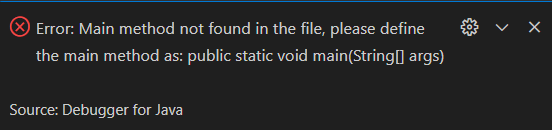
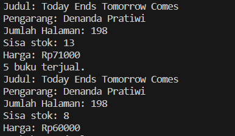
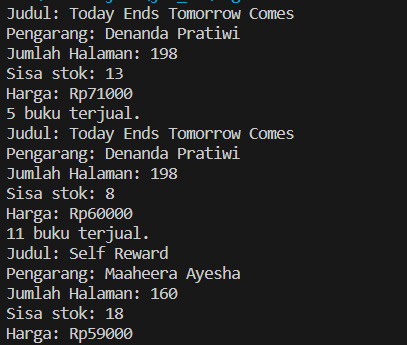
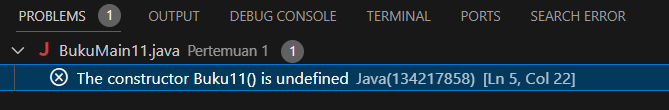
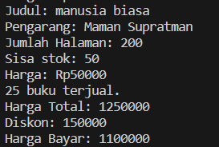
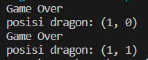

# <p align ="center"> LAPORAN PRAKTIKUM ALGORITMA DAN STRUKTUR DATA </p>

<br><br><br><br>

<p align="center">
    </p>

<br><br><br><br><br>

<p align = "center"> Nama  : Farhan Mawaludin </p>
<p align = "center"> NIM   : 2341720258 </p>
<p align = "center"> Prodi : TEKNIK INFORMATIKA</p>
<p align = "center"> Kelas : 1B </p>
<br><br>

# 2.1 Percobaan 1: Deklarasi Class, Atribut dan Method<br>

### 2.1.1 SS PRAKTIKUM 1

```java
public class Buku11 {

    String judul;
    String pengarang;
    int halaman;
    int stok;
    int harga;
    int terjual;


    void tampilInformasi() {
        System.out.println("Judul: " + judul);
        System.out.println("Pengarang: " + pengarang);
        System.out.println("Jumlah Halaman: " + halaman);
        System.out.println("Sisa stok: " + stok);
        System.out.println("Harga: Rp" + harga);
    }


    void terjual(int jml) {
            stok -= jml;

    }


    void restock(int jml) {
        stok += jml;
    }


    void gantiHarga(int hrg) {
        harga = hrg;
    }
}

```

### 2.1.2 SS VERIFIKASI HASIL PERCOBAAN


<br>

### 2.1.3 Pertanyaan

1. Sebutkan dua karakteristik class atau object!<br>
   jawab : karakteristik Atribut yang dimiliki oleh objek dari kelas tersebut.sedangkan Method ini merepresentasikan perilaku atau tindakan yang dapat dilakukan oleh objek dari kelas tersebut.
2. Perhatikan class Buku pada Praktikum 1 tersebut, ada berapa atribut yang dimiliki oleh class
   Buku? Sebutkan apa saja atributnya!<br>
   Jawab : Pada class buku terdapat 5 atribut yaitu judul (String),pengarang (String),halaman (int),stok (int),harga (int).
3. Ada berapa method yang dimiliki oleh class tersebut? Sebutkan apa saja methodnya!<br>
   Jawab : Pada class buku terdapat 4 method yaitu tampilInformasi(), terjual(int jml), restock(int jml), gantiHarga(int hrg)
4. Perhatikan method terjual() yang terdapat di dalam class Buku. Modifikasi isi method tersebut
   sehingga proses pengurangan hanya dapat dilakukan jika stok masih ada (lebih besar dari 0)!<br>
   Jawab:

   ```java
   void terjual(int jml) {
       if (stok > 0 && stok >=jml) {
           stok -= jml;
           System.out.println(jml + " buku terjual.");
       } else {
           System.out.println("Stok habis, tidak dapat melakukan penjualan.");
       }
   }

   ```

5. Menurut Anda, mengapa method restock() mempunyai satu parameter berupa bilangan int?<br>
   Jawab : karena parameter tersebut digunakan untuk menentukan jumlah buku yang akan ditambahkan ke stok.
6. Commit dan push kode program ke Github
   <br><br>

# Percobaan 2.2: Instansiasi Object, serta Mengakses Atribut dan Method<br>

### 2.2.1 SS PRAKTIKUM 2

```java
public class BukuMain11 {
    public static void main(String[] args) {

        Buku11 bk1 = new Buku11();


        bk1.judul = "Today Ends Tomorrow Comes";
        bk1.pengarang = "Denanda Pratiwi";
        bk1.halaman = 198;
        bk1.stok =13;
        bk1.harga = 71000;


        bk1.tampilInformasi();
        bk1.terjual(5);
        bk1.gantiHarga(60000);
        bk1.tampilInformasi();

    }
}
```

### 2.2.2 SS VERIFIKASI HASIL



### 2.2.3 Pertanyaan

1. Pada class BukuMain, tunjukkan baris kode program yang digunakan untuk proses instansiasi!
   Apa nama object yang dihasilkan?<br>
   Jawab :baris kode program <br>
   ```java
   Buku11 bk1 = new Buku11();
   ```
   <br>dengan nama objeknya bk1.
2. Bagaimana cara mengakses atribut dan method dari suatu objek?<br>
   Jawab : Caara mengakses atribut dan method dari suatu objek adalah dengan menggunakan nama objek diikuti dengan tanda titik dan nama atribut. sedangkan Untuk mengakses method dari objek, kita menggunakan nama objek diikuti dengan tanda titik dan nama method.
3. Mengapa hasil output pemanggilan method tampilInformasi() pertama dan kedua berbeda?<br>
   Jawab : Perbedaan output disebabkan oleh pemanggilan method terjual(5) yang mengurangi stok sebanyak 5 yang tadinya 13, dan kemudian menggunakan method gantiHarga(60000) yang mengubah harga buku menjadi Rp60000 yang tadinya 71000.

# 2.3 Percobaan 3: Membuat Konstruktor

<br>

### 2.3.1 SS PRAKTIKUM 3

```java
Buku11(){

    }

    public Buku11(String jud, String pg, int hal, int stok, int har) {
        judul=jud;
        pengarang=pg;
        halaman=hal;
        this.stok=stok;
        harga=har;
    }
```

```java
Buku11 bk2 = new Buku11("Self Reward", "Maaheera Ayesha", 160, 29, 59000);
        bk2.terjual(11);
        bk2.tampilInformasi();
```

### 2.3.2 SS VERIFIKASI HASIL



### 2.3.3 Pertanyaan

1. Pada class Buku di Percobaan 3, tunjukkan baris kode program yang digunakan untuk
   mendeklarasikan konstruktor berparameter!<br>
   Jawab :
   ```java
   public Buku11(String jud, String pg, int hal, int stok, int har) {
        judul=jud;
        pengarang=pg;
        halaman=hal;
        this.stok=stok;
        harga=har;
    }
   ```
2. Perhatikan class BukuMain. Apa sebenarnya yang dilakukan pada baris program berikut?<br>
   Jawab : Baris program ini membuat objek bk2 dengan nilai-nilai yang sudah ditentukan untuk setiap parameter konstruktor, yaitu judul, pengarang, halaman, stok, dan harga.
3. Hapus konstruktor default pada class Buku, kemudian compile dan run program. Bagaimana
   hasilnya? Jelaskan mengapa hasilnya demikian!<br>
   Jawab : Hasilnya adalah error <br><br>
   karena tidak ada konstruktor default yang dapat digunakan untuk membuat objek tanpa parameter.

4. Setelah melakukan instansiasi object, apakah method di dalam class Buku harus diakses
   secara berurutan? Jelaskan alasannya!<br>
   Jawab :Tidak harus berurutan, Karena setelah melakukan instansiasi method pada class buku11, method dapat dipanggil sesuai kebutuhan dan tidak harus urut.
5. Buat object baru dengan nama buku< NamaMahasiswa > menggunakan konstruktor
   berparameter dari class Buku!<br>
   Jawab :

   ```java
   Buku11 NamaMahasiswa = new Buku11("manusia biasa", "Maman Supratman", 200, 50, 50000);
        NamaMahasiswa.terjual(25);
        NamaMahasiswa.tampilInformasi();

   ```

6. Commit dan push kode program ke Github
   <br><br>

# 2.4 Latihan Praktikum

### Soal 1

```java
    int hitungHargaTotal(){
        int hargaTotal = harga * terjual;
        return hargaTotal;
    }

    int hitungDiskon(){
        int total = hitungHargaTotal();
        if(total > 150000){
            return (total * 12 / 100);
        } else if(total >= 75000 && total <= 150000){
            return (total * 5 / 100);
        } else {
            return 0;
        }
    }

    int hitungHargaBayar(){
        int total = hitungHargaTotal();
        int diskon = hitungDiskon();
        int hargaBayar = total - diskon;
        return hargaBayar;
    }

```

### Output Program

```java
Buku11 NamaMahasiswa = new Buku11("manusia biasa", "Maman Supratman", 200, 50, 50000);
        NamaMahasiswa.tampilInformasi();
        NamaMahasiswa.terjual(25);
        System.out.println("Harga Total: " + NamaMahasiswa.hitungHargaTotal());
        System.out.println("Diskon: " + NamaMahasiswa.hitungDiskon());
        System.out.println("Harga Bayar: " + NamaMahasiswa.hitungHargaBayar());
```

Output :<br>


### Soal 2

```java
public class Dragon11 {
    int x;
    int y;
    int width;
    int height;

    public Dragon11(int x, int y, int width, int height) {
        this.x = x;
        this.y = y;
        this.width = width;
        this.height = height;
    }

    void moveLeft() {
        if (x > 0) {
            x--;
            printPosition();
        } else {
            detectCollision(x, y);
        }
    }

    void moveRight() {
        if (x < width ) {
            x++;
            printPosition();
        } else {
            detectCollision(x, y);
        }
    }

    void moveUp() {
        if (y > 0) {
            y--;
            printPosition();
        } else {
            detectCollision(x, y);
        }
    }

    void moveDown() {
        if (y < height) {
            y++;
            printPosition();
        } else {
            detectCollision(x, y);
        }
    }

    void printPosition() {
        System.out.println("posisi dragon: (" + x + ", " + y + ")");
    }

    void detectCollision(int x, int y) {
        System.out.println("Game Over");
    }


}
```

```java
public class DragonMain11 {
    public static void main(String[] args) {
        Dragon11  dragon = new Dragon11 (0, 0,15,15);
        dragon.moveLeft();
        dragon.moveRight();
        dragon.moveUp();
        dragon.moveDown();

    }
}

```

### Ouput Program


