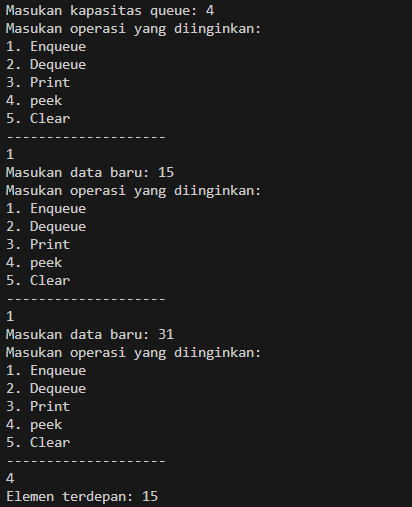
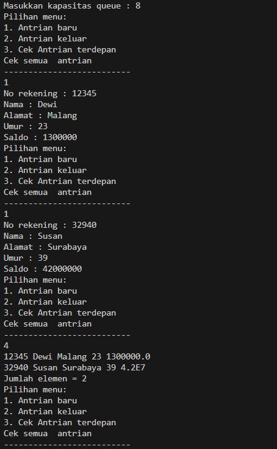
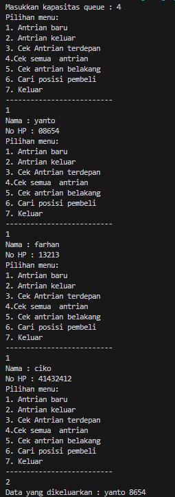
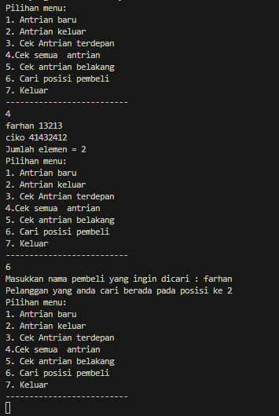

# <p align ="center"> LAPORAN PRAKTIKUM ALGORITMA DAN STRUKTUR DATA </p>

## <p align ="center"> PERTEMUAN VIII <br> STACK </p>

<br><br><br><br>

<p align="center">
    </p>

<br><br><br><br><br>

<p align = "center"> Nama  : Farhan Mawaludin </p>
<p align = "center"> NIM   : 2341720258 </p>
<p align = "center"> Prodi : TEKNIK INFORMATIKA</p>
<p align = "center"> Kelas : 1B </p>
<br><br>

# 10.2 Praktikum 1

<b> Kode class Queue11 </b><br>

```java
package Pertemuan10;

import javax.sound.midi.Soundbank;

public class Queue11 {
    int[] data;
    int front;
    int rear;
    int size;
    int max;

    Queue11(int n){
        max = n;
        data = new int[max];
        size = 0;
        front = rear = -1;
    }

    public boolean IsEmpty(){
        if (size ==0){
            return  true;
        }else{
            return false;
        }
    }

    public boolean IsFull(){
        if  (size == max){
            return true;
        }else{
            return false;
        }
    }

    public void peek(){
        if (!IsEmpty()){
            System.out.println("Elemen terdepan: " + data[front]);
        }else{
            System.out.println("Queue masih kosong");
        }
    }

    public void print(){
        if(IsEmpty()){
            System.out.println("Queue masih kosong");
        }else {
            int i = front;
            while (i !=rear) {
                System.out.println(data[i] + " ");
                i = (i+1) % max ;
            }
            System.out.println(data[i] + " ");
            System.out.println("Jumlah elemen = " + size);
        }
    }

    public void clear(){
        if(IsEmpty()){
            front = rear = -1;
            size = 0;
            System.out.println("Queue berhasil dikosongkan");
        }else{
            System.out.println("Queue masih kosong");
        }
    }

    public void Enqueue(int dt){
        if (IsFull()){
            System.out.println("Queue sudah penuh");
        }else{
            if(IsEmpty()){
                front = rear = 0;
            }else{
                if ( rear==max-1) {
                    rear=0;
                } else {
                    rear++;
                }
            }
            data[rear]=dt;
            size++;
        }
    }

    public int Dequeue(){
        int dt =0;
        if(IsEmpty()) {
            System.out.println("Queue masih kosong");
        }else{
            dt = data[front];
            size--;
            if( IsEmpty() ) {
                front = rear = -1;
            } else {
                if(front == max -1){
                    front =0;
                }else{
                    front++;
                }
            }
        }
        return dt;

    }

    public static void menu(){
        System.out.println("Masukan operasi yang diinginkan:");
        System.out.println("1. Enqueue");
        System.out.println("2. Dequeue");
        System.out.println("3. Print");
        System.out.println("4. peek");
        System.out.println("5. Clear");
        System.out.println("--------------------");
    }
}
```

<br><b>Kode main </b><br>

```java
package Pertemuan10;
import java.util.Scanner;

public class QueueMain {
    public static void main(String[] args) {
        Scanner sc = new Scanner(System.in);

        System.out.print("Masukan kapasitas queue: ");
        int n = sc.nextInt();

        Queue11 Q = new Queue11(n);

        int pilih;
        do {
            Queue11.menu();
            pilih = sc.nextInt();

            switch (pilih) {
                case 1:
                    System.out.print("Masukan data baru: ");
                    int dataMasuk = sc.nextInt();
                    Q.Enqueue(dataMasuk);
                    break;
                case 2:
                    int dataKeluar = Q.Dequeue();
                    if (dataKeluar != 0) {
                        System.out.println("Data yang dikeluarkan: " + dataKeluar);
                    }
                    break;
                case 3:
                    Q.print();
                    break;
                case 4:
                    Q.peek();
                    break;
                case 5:
                    Q.clear();
                    break;
            }
        } while (pilih == 1 || pilih == 2 || pilih == 3 || pilih == 4 || pilih == 5);
    }
}
```

<br><b>Output</b><br>



# 10.2.3 Pertanyaan

1. Pada konstruktor, mengapa nilai awal atribut front dan rear bernilai -1, sementara atribut size bernilai 0? <br>
   Jawab : nilai front dan rear bernilai -1 karena untuk memberitahu bahwa antriannya masih kosong dan atribut sizenya itu 0 karena belom ada elemen yang dimasukan.<br>
2. Pada method Enqueue, jelaskan maksud dan kegunaan dari potongan kode berikut! <br>

```java
if ( rear==max-1) {
    rear=0;
}
```

<br> 
Jawab : kode tersebut digunakan dan bermaksd jika rear sudah mencapai max-1 artinya arraynya sudah terisi penuh dan rear diatur kembali ke 0 untuk memulai dari awal.<br>

3. Pada method Dequeue, jelaskan maksud dan kegunaan dari potongan kode berikut!<br>

```java
if(front == max -1){
    front =0;
}
```

 <br>
 Jawab : digunakan untuk mengatur ulang front ketika elemen pertama diambil, dan jika front sama dengan max-1 berarti sudah sampe di ahir array maka front diatur ulang ke 0<br>

4. Pada method print, mengapa pada proses perulangan variabel i tidak dimulai dari 0 (int i=0), melainkan int i=front? <br>
   Jawab : karena ingin mencetak secara berurutan dari lemen pertama<br>

5. Perhatikan kembali method print, jelaskan maksud dari potongan kode berikut!<br>

```java
i = (i+1) % max ;
```

 <br>
 Jawab : digunakan untuk mengatur ulang nilai i dengan mod agar indeks i kembali ke 0 setelah mencapai max-1<br>

6. Tunjukkan potongan kode program yang merupakan queue overflow! <br>
   Jawab :<br>

```java
   public void Enqueue(int dt){
        if (IsFull()){
            System.out.println("Queue sudah penuh");
            System.exit(1);
        }else{
            if(IsEmpty()){
                front = rear = 0;
            }else{
                if ( rear==max-1) {
                    rear=0;
                } else {
                    rear++;
                }
            }
            data[rear]=dt;
            size++;
        }
    }
```

7. Pada saat terjadi queue overflow dan queue underflow, program tersebut tetap dapat berjalan dan hanya menampilkan teks informasi. Lakukan modifikasi program sehingga pada saat terjadi queue overflow dan queue underflow, program dihentikan!<br>
   Jawab :

```java
public void Enqueue(int dt){
        if (IsFull()){
            System.out.println("Queue sudah penuh");
            System.exit(1);
```

```java
public int Dequeue(){
        int dt =0;
        if(IsEmpty()) {
            System.out.println("Queue masih kosong");
            System.exit(1);
```

# 10.3 Praktikum 2

<br><b>Kode class nasabah</b><br>

```java
package Pertemuan10;

public class nasabah11 {
    String norek;
    String nama;
    String alamat;
    int umur;
    double saldo;

    nasabah11(String norek, String nama, String alamat, int umur, double saldo){
        this.norek = norek;
        this.nama = nama;
        this.alamat = alamat;
        this.umur = umur;
        this.saldo = saldo;
    }

}
```

<br><b>Kode QUEUEMAIN2</b><br>

```java
package Pertemuan10;


import java.util.Scanner;

public class QUEUEMAIN2 {
    public static void main(String[] args) {
        Scanner sc11 = new Scanner(System.in);
        Scanner sc111 = new Scanner(System.in);
        System.out.print("Masukkan kapasitas queue : ");
        int jumlah = sc11.nextInt();

        QUEUE211 Q = new QUEUE211(jumlah);

        int pilih = 0;
        do {
            Q.menu();
            pilih = sc11.nextInt();
            switch (pilih) {
                case 1:
                    System.out.print("No rekening : ");
                    String norek = sc111.nextLine();
                    System.out.print("Nama : ");
                    String nama = sc111.nextLine();
                    System.out.print("Alamat : ");
                    String alamat = sc111.nextLine();
                    System.out.print("Umur : ");
                    int umur = sc11.nextInt();
                    System.out.print("Saldo : ");
                    int saldo = sc11.nextInt();
                    nasabah11 nb = new nasabah11(norek, nama, alamat, umur, saldo);
                    Q.Enqueue(nb);
                    break;
                case 2:
                    nasabah11 data = Q.Dequeue();
                    if (!"".equals(data.norek) && !"".equals(data.nama) && !"".equals(data.alamat) && data.umur != 0
                            && data.saldo != 0) {
                        System.out.println("Data yang dikeluarkan : " + data.norek + " " + data.nama + " " + data.alamat
                                + " " + data.umur + " " + data.saldo);
                    }
                    break;
                case 3:
                    Q.peek();
                    break;
                case 4:
                    Q.print();
                    break;
                default:
                    break;
            }
        } while (pilih == 1 || pilih == 2 || pilih == 3 || pilih == 4);
    }
}

```

<br><b>Kode QUEUE211</b><br>

```java
package Pertemuan10;

public class QUEUE211 {
    nasabah11[] data;
    int front, rear, size, max;

    QUEUE211(int n) {
        max = n;
        data = new nasabah11[max];
        size = 0;
        front = rear = -1;
    }

    public boolean IsEmpty() {
        if (size == 0) {
            return true;
        } else {
            return false;
        }
    }

    public boolean IsFull() {
        if (size == max) {
            return true;
        } else {
            return false;
        }
    }

    void peek() {
        if (!IsEmpty()) {
            System.out.println("Elemen terdepan : " + data[front].norek + " " + data[front].nama + " "
                    + data[front].alamat + " " + data[front].umur + " " + data[front].saldo);
        } else {
            System.out.println("Queue masih kosong");
        }
    }

    void print() {
        if (IsEmpty()) {
            System.out.println("Queue masih kosong");
        } else {
            int i = front;
            while (i != rear) {
                System.out.println(data[i].norek + " " + data[i].nama + " "
                        + data[i].alamat + " " + data[i].umur + " " + data[i].saldo);
                i = (i + 1) % max;
            }
            System.out.println(data[i].norek + " " + data[i].nama + " "
                    + data[i].alamat + " " + data[i].umur + " " + data[i].saldo);
            System.out.println("Jumlah elemen = " + size);
        }
    }

    void clear() {
        if (!IsEmpty()) {
            front = rear = -1;
            size = 0;
            System.out.println("Queue berhasil dikosongkan");
        } else {
            System.out.println("Queue masih kosong");
        }
    }

    void Enqueue(nasabah11 dt) {
        if (IsFull()) {
            System.out.println("Queue sudah penuh");
            System.exit(1);
        } else {
            if (IsEmpty()) {
                front = rear = 0;
            } else {
                if (rear == max - 1) {
                    rear = 0;
                } else {
                    rear++;
                }
            }
            data[rear] = dt;
            size++;
        }
    }

    public nasabah11 Dequeue() {
        nasabah11 dt = new nasabah11(null, null, null, max, front);
        if (IsEmpty()) {
            System.out.println("Queue masih kosong");
            System.exit(1);
        } else {
            dt = data[front];
            size--;
            if (IsEmpty()) {
                front = rear = -1;
            } else {
                if (front == max - 1) {
                    front = 0;
                } else {
                    front++;
                }
            }
        }
        return dt;
    }


    public void menu(){
        System.out.println("Pilihan menu: ");
        System.out.println("1. Antrian baru");
        System.out.println("2. Antrian keluar");
        System.out.println("3. Cek Antrian terdepan");
        System.out.println("Cek semua  antrian");
        System.out.println("--------------------------");

    }


}

```

<br><b>Output</b><br>



# 10.3.3 Pertanyaan

1. Pada class QueueMain, jelaskan fungsi IF pada potongan kode program berikut!<br>

```java
if (!"".equals(data.norek) && !"".equals(data.nama) && !"".equals(data.alamat) && data.umur != 0
                            && data.saldo != 0) {
                        System.out.println("Data yang dikeluarkan : " + data.norek + " " + data.nama + " " + data.alamat
                                + " " + data.umur + " " + data.saldo);
                    }
```

Jawab : untuk memastikan bahwa data nasabah yang dikeluarkan dari antrian adalah data yang lengkap dan valid sebelum dicetak ke layar.<br> 2. Lakukan modifikasi program dengan menambahkan method baru bernama peekRear pada class Queue yang digunakan untuk mengecek antrian yang berada di posisi belakang! Tambahkan pula daftar menu 5. Cek Antrian paling belakang pada class QueueMain sehingga method peekRear dapat dipanggil! <br>
Jawab :

```java
void PeekRear() {
        if (!IsEmpty()) {
            System.out.println("Elemen paling belakang : " + data[rear].norek + " " + data[rear].nama + " "
                    + data[rear].alamat + " " + data[rear].umur + " " + data[rear].saldo);
        } else {
            System.out.println("Queue masih kosong");
        }
    }
```

```java
case 5:
    Q.PeekRear();
    break;
```

# 10.4 Tugas

<br><b>Kode pembeli</b><br>

```java
package Pertemuan10;

public class pembeli11 {
    String nama;
    int noHP;

    public pembeli11(String nama,int noHP){
        this.nama = nama;
        this.noHP = noHP;
    }
}
```

<br><b>Kode Queue Pembeli</b><br>

```java
package Pertemuan10;

public class QueuePembeli11{
    pembeli11[] antrian;
    int front;
    int rear;
    int size;
    int max;

    QueuePembeli11(int n) {
        max = n;
        antrian = new pembeli11[max];
        size = 0;
        front = rear = -1;
    }

    public boolean isEmpty() {
        return size == 0;
    }

    public boolean isFull() {
        return size == max;
    }

    void Enqueue(pembeli11 antri) {
        if (isFull()) {
            System.out.println("Antrian sudah penuh");
            return;
        } else {
            if (isEmpty()) {
                front = rear = 0;
            } else {
                rear = (rear + 1) % max;
            }
            antrian[rear] = antri;
            size++;
        }
    }

    public pembeli11 Dequeue() {
        pembeli11 antri = null;
        if (isEmpty()) {
            System.out.println("Antrian masih kosong");
        } else {
            antri = antrian[front];
            size--;
            if (isEmpty()) {
                front = rear = -1;
            } else {
                front = (front + 1) % max;
            }
        }
        return antri;
    }

    void Peek() {
        if (!isEmpty()) {
            System.out.println("Elemen terdepan : " + antrian[front].nama + " "
                    + antrian[front].noHP);
        } else {
            System.out.println("Antrian masih kosong");
        }
    }

    void PeekRear() {
        if (!isEmpty()) {
            System.out.println("Elemen paling belakang : " + antrian[rear].nama + " "
                    + antrian[rear].noHP);
        } else {
            System.out.println("Antrian masih kosong");
        }
    }

    void DaftarPembeli() {
        if (isEmpty()) {
            System.out.println("Antrian masih kosong");
        } else {
            int i = front;
            while (i != rear) {
                System.out.println(antrian[i].nama + " "
                        + antrian[i].noHP);
                i = (i + 1) % max;
            }
            System.out.println(antrian[i].nama + " "
                    + antrian[i].noHP);
            System.out.println("Jumlah elemen = " + size);
        }
    }

    void PeekPosition(String nama) {
        int pos = -1;
        int i = front;
        while (i != rear) {
            if (antrian[i].nama.equals(nama)) {
                pos = i;
            }
            i = (i + 1) % max;
        }
        if (pos > 0) {
            System.out.println("Pelanggan yang anda cari berada pada posisi ke " + (pos + 1));
        } else {
            System.out.println("Pelanggan yang anda cari tidak ada");
        }
    }

    public void menu(){
        System.out.println("Pilihan menu: ");
        System.out.println("1. Antrian baru");
        System.out.println("2. Antrian keluar");
        System.out.println("3. Cek Antrian terdepan");
        System.out.println("4.Cek semua  antrian");
        System.out.println("5. Cek antrian belakang");
        System.out.println("6. Cari posisi pembeli");
        System.out.println("7. Keluar");
        System.out.println("--------------------------");

    }

}
```

<br><b>Kode Pembeli main</b><br>

```java
package Pertemuan10;

import java.util.Scanner;

public class PembeliMain {
     public static void main(String[] args) {
        Scanner sc11 = new Scanner(System.in);
        Scanner sc111 = new Scanner(System.in);
        System.out.print("Masukkan kapasitas queue : ");
        int jumlah = sc11.nextInt();

        QueuePembeli11 Q = new QueuePembeli11(jumlah);

        int pilih = 0;

        do {
            Q.menu();
            pilih = sc11.nextInt();
            switch (pilih) {
                case 1:
                    System.out.print("Nama : ");
                    String nama = sc111.nextLine();
                    System.out.print("No HP : ");
                    int noHP = sc11.nextInt();
                    pembeli11 nb = new pembeli11(nama, noHP);
                    Q.Enqueue(nb);
                    break;
                case 2:
                    pembeli11 data = Q.Dequeue();
                    if (!"".equals(data.nama) && data.noHP != 0) {
                        System.out.println("Data yang dikeluarkan : " + data.nama + " " + data.noHP);
                    }
                    break;
                case 3:
                    Q.Peek();
                    break;
                case 4:
                    Q.DaftarPembeli();
                    break;
                case 5:
                    Q.PeekRear();
                    break;
                case 6:
                    System.out.print("Masukkan nama pembeli yang ingin dicari : ");
                    String cariNama = sc111.nextLine();
                    Q.PeekPosition(cariNama);
                    break;
            }
        } while (pilih == 1 || pilih == 2 || pilih == 3 || pilih == 4 || pilih == 5 || pilih == 6);
     }
}
```

<br><b>Output</b><br>

 <br>

