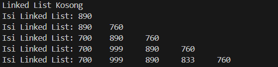
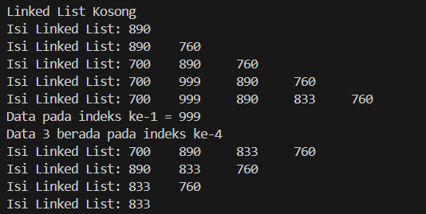
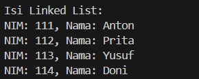
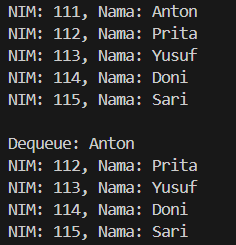

# <p align ="center"> LAPORAN PRAKTIKUM ALGORITMA DAN STRUKTUR DATA </p>

## <p align ="center"> PERTEMUAN IX <br> UTS </p>

<br><br><br><br>

<p align="center">
    </p>

<br><br><br><br><br>

<p align = "center"> Nama  : Farhan Mawaludin </p>
<p align = "center"> NIM   : 2341720258 </p>
<p align = "center"> Prodi : TEKNIK INFORMATIKA</p>
<p align = "center"> Kelas : 1B </p>
<br><br>

# 2.1 Pembuatan Single Linked List

<br><b> Kode Node </b><br>

```java
package Pertemuan11;

public class Node11 {
    int data;
    Node11 next;

    public Node11(int nilai, Node11 berikutnya){
        data = nilai;
        next = berikutnya;
    }
}
```

<br><b> Kode SingleLinkedList </b><br>

```java
package Pertemuan11;

public class SingleLinkedList11 {
    Node11 head, tail;

    boolean isEmpty() {
        return head == null;
    }

    void print() {
        if (!isEmpty()) {
            Node11 tmp = head;
            System.out.print("Isi Linked List: ");
            while (tmp != null) {
                System.out.print(tmp.data + "\t");
                tmp = tmp.next;
            }
            System.out.println("");
        } else {
            System.out.println("Linked List Kosong");
        }
    }

    void addFirst(int input) {
        Node11 ndInput = new Node11(input, null);
        if (isEmpty()) {
            head = ndInput;
            tail = ndInput;
        } else {
            ndInput.next = head;
            head = ndInput;
        }
    }

    void addLast(int input) {
        Node11 ndInput = new Node11(input, null);
        if (isEmpty()) {
            head = ndInput;
            tail = ndInput;
        } else {
            tail.next = ndInput;
            tail = ndInput;
        }
    }

    void insertAfter(int key, int input) {
        Node11 ndInput = new Node11(input, null);
        Node11 temp = head;
        while (temp != null) {
            if (temp.data == key) {
                ndInput.next = temp.next;
                temp.next = ndInput;
                if (ndInput.next == null) {
                    tail = ndInput;
                }
                break;
            }
            temp = temp.next;
        }
    }

    void insertAt(int index, int input) {
        if (index < 0) {
            System.out.println("Index tidak boleh negatif!");
        } else if (index == 0) {
            addFirst(input);
        } else {
            Node11 temp = head;
            for (int i = 0; i < index - 1; i++) {
                if (temp == null) {
                    System.out.println("Index melebihi panjang linked list!");
                    return;
                }
                temp = temp.next;
            }
            if (temp == null) {
                System.out.println("Index melebihi panjang linked list!");
            } else {
                temp.next = new Node11(input, temp.next);
                if (temp.next.next == null) {
                    tail = temp.next;
                }
            }
        }
    }
}
```

<br><b> Kode SLLMain </b><br>

```java
package Pertemuan11;

public class SLLMain11 {
    public static void main(String[] args) {
        SingleLinkedList11 singLL = new SingleLinkedList11() ;

        singLL.print();
        singLL.addFirst(890);
        singLL.print();
        singLL.addLast(760);
        singLL.print();
        singLL.addFirst(700);
        singLL.print();
        singLL.insertAfter(700, 999);
        singLL.print();
        singLL.insertAt(3, 833);
        singLL.print();
    }
}
```

<br><b> Output </b><br>



# 2.1.2 Pertanyaan

1. Mengapa hasil compile kode program di baris pertama menghasilkan “Linked List Kosong”? <br>
   Jawab : Karena pada saat program pertama kali dijalankan linked listnya masih kosong jadi pada kondisi isempty pada metode print akan true dan menceteak linked list kosong
2. Jelaskan kegunaan variable temp secara umum pada setiap method!<br>
   Jawab : untuk melakukan operasi seperti penambahan, penghapusan atau pencarian node dalam linked list
3. Perhatikan class SingleLinkedList, pada method insertAt Jelaskan kegunaan kode berikut<br>

```java
if (temp.next.next == null) {
    tail = temp.next;
}
```

<br> Jawab : digunakan untuk memastikan bahwa node baru yang dita,,bahkan diakhir diatur untuk menunjuk ke node baru dan memeriksa apakah node yang ditunjuk merupakan node terakhir , jika ya maka akan diatur ke node baru dan tail selalu menunjuk ke node terakhir.

# 2.2 Modifikasi Elemen pada Single Linked List

<br><b> kode </b><br>

```java
int getData(int index){
        Node11 tmp = head;
        for (int i = 0; i < index ; i++){
            tmp = tmp.next;
        }
        return tmp.data;
    }

    int indexOf(int key){
        Node11 tmp = head;
        int index = 0;
        while (tmp != null && tmp.data != key){
            tmp = tmp.next;
            index++;
        }
        if(tmp != null){
            return index;
        } else {
            return -1;
        }
    }

    void removeFirst(){
        if(!isEmpty()){
            head = head.next;
            if(head == null){
                tail = null;
            }
        }else{
            System.out.println("Linked list masih kosong, tidak dapat dihapus");
        }
    }

    void removeLast(){
        if(!isEmpty()){
            if(head == tail){
                head = tail = null;
            }else{
                Node11 temp = head;
                while(temp.next != tail){
                    temp = temp.next;
                }
                temp.next = null;
                tail = temp;
            }
        }else{
            System.out.println("Linked list masih kosong, tidak dapat dihapus");
        }
    }


    void remove(int key){
        if(!isEmpty()){
            if(head.data == key){
                removeFirst();
            }else{
                Node11 temp = head;
                while(temp.next != null && temp.next.data != key){
                    temp = temp.next;
                }
                if(temp.next != null){
                    temp.next = temp.next.next;
                    if(temp.next == null){
                        tail = temp;
                    }
                }else{
                    System.out.println("Data tidak ditemukan dalam linked list");
                }
            }
        }else{
            System.out.println("Linked list masih kosong, tidak dapat dihapus");
        }
    }

    public void removeAt(int index){
        if (index == 0){
            removeFirst();
        }else if(index == indexOf(tail.data)){
            removeLast();
        }else{
            Node11 temp = head;
            for(int i = 0; i < index -1; i++){
                temp = temp.next;
            }
            temp.next = temp.next.next;
        }
    }
```

<br><b> kode SLLMain</b><br>

```java
package Pertemuan11;

public class SLLMain11 {
    public static void main(String[] args) {
        SingleLinkedList11 singLL = new SingleLinkedList11() ;

        singLL.print();
        singLL.addFirst(890);
        singLL.print();
        singLL.addLast(760);
        singLL.print();
        singLL.addFirst(700);
        singLL.print();
        singLL.insertAfter(700, 999);
        singLL.print();
        singLL.insertAt(3, 833);
        singLL.print();

        System.out.println("Data pada indeks ke-1 = " + singLL.getData(1));
        System.out.println("Data 3 berada pada indeks ke-"+ singLL.indexOf(760));

        singLL.remove(999);
        singLL.print();
        singLL.removeAt(0);
        singLL.print();
        singLL.removeFirst();
        singLL.print();
        singLL.removeLast();
        singLL.print();
    }
}
```

<br><b> Output </b><br>



# 2.2.3 Pertanyaan

1. Mengapa digunakan keyword break pada fungsi remove? Jelaskan!<br>
   Jawab : Keyword break pada fungsi remove digunakan untuk menghentikan iterasi saat elemen yang ingin dihapus ditemukan.
2. Jelaskan kegunaan kode dibawah pada method remove<br>

```java
else if(temp.next.data == key){
    temp.next = temp.next.next
}
```

<br>
Jawab : kode tersebut mengubah pointer dari elemen sebelumnya (temp) agar menunjuk langsung ke elemen setelahnya dari elemen yang ingin dihapus.

# 3. Tugas

1. Implementasikan ilustrasi Linked List Berikut. Gunakan 4 macam penambahan data yang telah dipelajari sebelumnya untuk menginputkan data. <br>
   Jawab :<br>
   <b>Kode Mahasiswa</b><br>

```java
package Pertemuan11;

public class Mahasiswa {
    int NIM;
    String Nama;
    Mahasiswa next;

    public Mahasiswa(int NIM, String Nama) {
        this.NIM = NIM;
        this.Nama = Nama;
        this.next = null;
    }
}
```

<br<b>Kode MahasiswaLinkedList</b><br>

```java
package Pertemuan11;

public class MahasiswaLinkedList {
    Mahasiswa head;

    public MahasiswaLinkedList() {
        this.head = null;
    }

    public void addFirst(int NIM, String Nama) {
        Mahasiswa baru = new Mahasiswa(NIM, Nama);
        baru.next = head;
        head = baru;
    }

    public void addLast(int NIM, String Nama) {
        Mahasiswa baru = new Mahasiswa(NIM, Nama);
        if (head == null) {
            head = baru;
            return;
        }
        Mahasiswa temp = head;
        while (temp.next != null) {
            temp = temp.next;
        }
        temp.next = baru;
    }

    public void insertAfter(int kunci, int NIM, String Nama) {
        Mahasiswa baru = new Mahasiswa(NIM, Nama);
        Mahasiswa temp = head;
        while (temp != null && temp.NIM != kunci) {
            temp = temp.next;
        }
        if (temp == null) {
            System.out.println("Data dengan NIM " + kunci + " tidak ditemukan.");
            return;
        }
        baru.next = temp.next;
        temp.next = baru;
    }

    public void insertAt(int posisi, int NIM, String Nama) {
        if (posisi < 0) {
            System.out.println("Posisi tidak boleh negatif!");
            return;
        }
        if (posisi == 0) {
            addFirst(NIM, Nama);
            return;
        }
        Mahasiswa baru = new Mahasiswa(NIM, Nama);
        Mahasiswa temp = head;
        for (int i = 0; i < posisi - 1; i++) {
            if (temp == null) {
                System.out.println("Posisi melebihi panjang linked list!");
                return;
            }
            temp = temp.next;
        }
        if (temp == null) {
            System.out.println("Posisi melebihi panjang linked list!");
            return;
        }
        baru.next = temp.next;
        temp.next = baru;
    }

    public void cetak() {
        Mahasiswa temp = head;
        System.out.println("Isi Linked List:");
        while (temp != null) {
            System.out.println("NIM: " + temp.NIM + ", Nama: " + temp.Nama);
            temp = temp.next;
        }
        System.out.println();
    }
}
```

<br><b>Kode MahasiswaMain</b><br>

```java
package Pertemuan11;


public class MahasiswaMain {
    public static void main(String[] args) {
        MahasiswaLinkedList linkedList = new MahasiswaLinkedList();


        linkedList.addFirst(111, "Anton");
        linkedList.addLast(112, "Prita");
        linkedList.insertAfter(112, 113, "Yusuf");
        linkedList.insertAt(3, 114, "Doni");

        linkedList.cetak();
    }
}
```

<br><b>Output</b><br>



2. Buatlah implementasi program antrian layanan unit kemahasiswaan sesuai dengan kondisi yang ditunjukkan pada soal nomor 1! Ketentuan <br>
   a. Implementasi antrian menggunakan Queue berbasis Linked List! <br>
   b. Program merupakan proyek baru, bukan modifikasi dari soal nomor 1! <br>
   Jawab :<br>
   <b>Kode MahasiswaQueue</b><br>

```java
package Pertemuan11;

class MahasiswaQueue {
    int NIM;
    String nama;
    MahasiswaQueue next;

    MahasiswaQueue(int NIM, String nama) {
        this.NIM = NIM;
        this.nama = nama;
        this.next = null;
    }
}
```

<br><b>Kode Queue</b><br>

```java
package Pertemuan11;

class Queue {
    MahasiswaQueue front, rear;

    Queue() {
        this.front = this.rear = null;
    }


    void enqueue(int NIM, String nama) {
        MahasiswaQueue newNode = new MahasiswaQueue(NIM, nama);
        if (this.rear == null) {
            this.front = this.rear = newNode;
            return;
        }
        this.rear.next = newNode;
        this.rear = newNode;
    }


    MahasiswaQueue dequeue() {
        if (this.front == null) return null;
        MahasiswaQueue temp = this.front;
        this.front = this.front.next;
        if (this.front == null) this.rear = null;
        return temp;
    }

    void printQueue() {
        MahasiswaQueue current = front;
        while (current != null) {
            System.out.println("NIM: " + current.NIM + ", Nama: " + current.nama);
            current = current.next;
        }
    }
}
```

<br><b>Kode MainQueue</b><br>

```java
package Pertemuan11;

public class MainQueue {
    public static void main(String[] args) {
        Queue queue = new Queue();
        queue.enqueue(111, "Anton");
        queue.enqueue(112, "Prita");
        queue.enqueue(113, "Yusuf");
        queue.enqueue(114, "Doni");
        queue.enqueue(115, "Sari");

        queue.printQueue();

        System.out.println("\nDequeue: " + queue.dequeue().nama);
        queue.printQueue();
    }

}
```

<br><b>Output</b><br>


