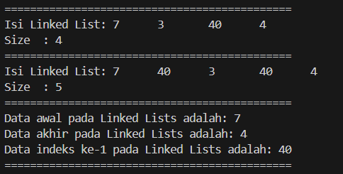
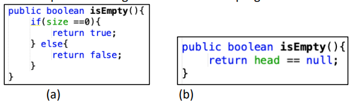
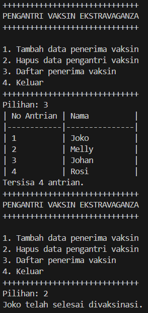
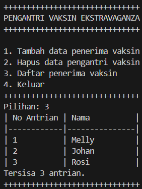
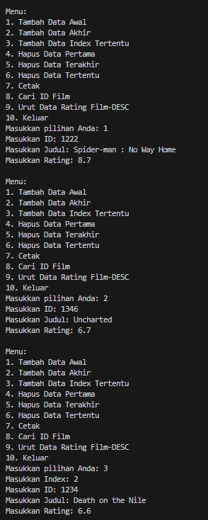
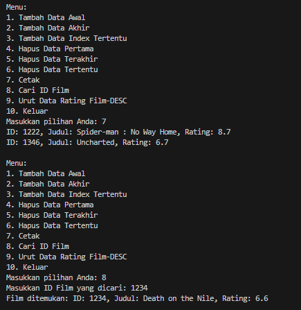

# <p align ="center"> LAPORAN PRAKTIKUM ALGORITMA DAN STRUKTUR DATA </p>

## <p align ="center"> PERTEMUAN IX <br> Double Linked List </p>

<br><br><br><br>

<p align="center">
    </p>

<br><br><br><br><br>

<p align = "center"> Nama  : Farhan Mawaludin </p>
<p align = "center"> NIM   : 2341720258 </p>
<p align = "center"> Prodi : TEKNIK INFORMATIKA</p>
<p align = "center"> Kelas : 1B </p>
<br><br>


# 12.2.1 Percobaan 1
<b>Kode Node11</b>

``` java
package Pertemuan12;

public class Node11 {
    int data;
    Node11 prev,next;

    Node11(Node11 prev, int data, Node11 next){
        this.prev = prev;
        this.data = data;
        this.next = next;
    }
}
```
<br><b>Kode doubleLinkedList</b>

```java
package Pertemuan12;


public class doubleLinkedList {
    Node11 head;
    int size;
    
    public doubleLinkedList() {
        head = null;
        size =0;
    }

    public boolean isEmpty(){
        return head == null;
    }

    public void addFirst(int item){
        if(isEmpty()){
            head = new Node11(null, item, head);
        }else{
            Node11 newNode = new Node11(null, item, head);
            head.prev = newNode;
            head = newNode;
        }
        size++;
    }

    public void addLast(int item){
        if(isEmpty()){
            addFirst(item);
        }else{
            Node11 current = head;
            while (current.next != null){
                current = current.next;
            }
            Node11 newNode = new Node11(current, item, null);
            current.next = newNode;
            size++;
        }    
    }

    public void add(int item, int index) throws Exception {
        if (isEmpty()) {
            addFirst(item);
        } else if (index < 0 || index > size) {
            throw new Exception("Nilai indeks di luar batas");
        } else {
            Node11 current = head;
            int i = 0;
            while (i < index) {
                current = current.next;
                i++;
            }
            if (current.prev == null){
                Node11 newNode = new Node11(null, item, current);
                current.prev = newNode;
                head = newNode;
            }else{
                Node11 newNode = new Node11(current.prev, item, current);
                newNode.prev = current.prev;
                newNode.next = current;
                current.prev.next = newNode;
                current.prev = newNode;
            }
        }
        size++;
    }

    public int size(){
        return size;
    }

    public void clear(){
        head = null;
        size = 0;
    }

    public void print(){
        if(!isEmpty()){
            Node11 tmp = head;
            System.out.print("Isi Linked List: ");
            while (tmp != null){
                System.out.print(tmp.data + "\t");
                tmp = tmp.next;
            }
            System.out.println();
        }else{
            System.out.println("Linked List Kosong");
        }
    }
}
```
<br><b>Kode doubleLinkedListMain</b>

``` java
package Pertemuan12;

public class DoubleLinkedListMain {
    public static void main(String[] args) throws Exception {
        doubleLinkedList dll = new doubleLinkedList();
        dll.print();
        System.out.println("Size  : " + dll.size());
        System.out.println("===========================================");
        dll.addFirst(3);
        dll.addLast(4);
        dll.addFirst(7);
        dll.print();
        System.out.println("============================================");
        dll.add(40, 1);
        dll.print();
        System.out.println("Size : " + dll.size());
        System.out.println("============================================");
        dll.clear();
        dll.print();
        System.out.println("Size : " + dll.size());
    }
}
```

<b>Output</b>


#  Pertanyaan Percobaan

1. Jelaskan perbedaan antara single linked list dengan double linked lists!<br>
Jawab : Single linked list hanya memiliki satu pointer, yaitu next, yang menunjukkan node selanjutnya. Double linked list memiliki dua pointer, next dan previous, yang menunjukkan node selanjutnya dan node sebelumnya.<br>
2. Perhatikan class Node, di dalamnya terdapat atribut next dan prev. Untuk apakah atribut tersebut?
Jawab : next digunakan sebagai pointer untuk node berikutnya, sedangkan prev digunakan sebagai pointer untuk node sebelumnya.
3. Perhatikan konstruktor pada class DoubleLinkedLists. Apa kegunaan inisialisasi atribut head dan size seperti pada gambar berikut ini?<br>
Jawab : Untuk menginisialisasi awal double linked list sebagai kosong.<br>
4. Pada method addFirst(), kenapa dalam pembuatan object dari konstruktor class Node prev dianggap sama dengan null?<br>
Jawab : Karena node pertama tidak memiliki node sebelumnya, sehingga prev bernilai null.<br>
5. Perhatikan pada method addFirst(). Apakah arti statement head.prev = newNode ?<br>
Jawab : Jika double linked list sudah berisi node, node baru yang ditambahkan di awal harus ditempatkan sebelum head saat ini, sehingga node baru menjadi head baru.<br>
6. Perhatikan isi method addLast(), apa arti dari pembuatan object Node dengan mengisikan parameter prev dengan current, dan next dengan null?
Jawab : Node baru ditambahkan di akhir list, sehingga next bernilai null karena tidak ada node setelahnya, dan prev menunjuk ke node terakhir saat ini.<br>
7. Pada method add(), terdapat potongan kode program sebagai berikut ... jelaskan maksud dari bagian yang ditandai dengan kotak kuning.<br>
Jawab : Kode pada method add() menangani penyisipan node baru di awal list, memastikan node baru menjadi head baru.


# 12.3.1 Percobaan 2

<b>Tambahan percobaan 2</b>

``` java
public void removeFirst() throws Exception {
    if (isEmpty()) {
        throw new Exception("Linked List masih kosong, tidak dapat dihapus");
    } else if (size == 1) {
        removeLast();
    } else {
        head = head.next;
        head.prev = null;
        size--;
        }
    }

public void removeLast() throws Exception {
    if (isEmpty()) {
        throw new Exception ("Linked List masih kosong, tidak dapat dihapus");
    } else if (head.next == null) {
        head = null;
        size--;
        return;
    }

    Node11 current = head;
    while (current.next.next != null) {
        current = current.next;
    }
    current.next = null;
    size--;
    }

public void removeAt(int index) throws Exception {
    if (isEmpty() || index >= size) {
        throw new Exception("Nilai indeks diluar batas");
    } else if (index == 0) {
        removeFirst();
    } else {
        Node11 current = head;
        int i = 0;
        while (i < index) {
            current = current.next;
            i++;
        }
        if (current.next == null) {
            current.prev.next= null;
        } else if (current.prev == null) {
            current = current.next;
            current.prev=null;
            head = current;
        } else {
            current.prev.next = current.next;
            current.next.prev = current.prev;
        }
        size--;
        }
    }
```

<br><b>tambahan di kelas main</b><br>

``` java
dll.addLast(50);
        dll.addLast(40);
        dll.addLast(10);
        dll.addLast(20);
        dll.print();
        System.out.println("Size  : " + dll.size());
        System.out.println("=============================================");
        dll.removeFirst();
        dll.print();
        System.out.println("Size  : " + dll.size());
        System.out.println("=============================================");
        dll.removeLast();
        dll.print();
        System.out.println("Size  : " + dll.size());
        System.out.println("=============================================");
        dll.removeAt(1);
        dll.print();
        System.out.println("Size  : " + dll.size());
        System.out.println("=============================================");
    }
```


<br><b>Output</b>


# 12.3.3 Pertanyaan Percobaan
1. Apakah maksud statement berikut pada method removeFirst()?
head = head.next;
head.prev = null;<br>
Jawab :Pada method removeFirst(), statement head = head.next; mengarahkan head ke node berikutnya dalam linked list, sehingga node pertama diabaikan. Kemudian, head.prev = null; menghapus referensi dari node kedua ke node pertama, sehingga node pertama sepenuhnya terputus dari linked list.<br>
2. Bagaimana cara mendeteksi posisi data ada pada bagian akhir pada method removeLast()?<br>
Jawab : Untuk mendeteksi posisi data di bagian akhir pada method removeLast(), pertama-tama dibuat variabel penunjuk yang mengarah ke node terakhir. Langkahnya adalah menelusuri linked list mulai dari head hingga menemukan node yang pointer next-nya null, yang menandakan bahwa node tersebut adalah node terakhir. Setelah node terakhir ditemukan, kita dapat mengubah pointer next dari node sebelumnya menjadi null, dan jika hanya ada satu node, kita mengatur head menjadi null.
3. Jelaskan alasan potongan kode program di bawah ini tidak cocok untuk perintah remove!<br>
Jawab : Dalam potongan kode ini, head.next berguna untuk menghubungkan node setelah node yang akan dihapus; namun, tmp.next tidak diatur menjadi null, sehingga masih ada referensi pada node yang akan dihapus dari daftar yang terhubung. Selain itu, sebelum menghapus node, pastikan bahwa atribut prev dari node setelah node yang dihapus juga diperbarui dengan benar.
4. Jelaskan fungsi kode program berikut ini pada fungsi remove!<br>
Jawab : Fungsi kode program tersebut pada fungsi remove adalah untuk menghapus node current dari linked list. Kode ini memastikan bahwa referensi next dan prev dari node sekitar current diperbarui dengan benar sehingga node current dapat dihapus tanpa merusak struktur linked list.


# 12.4.1 Percobaan 3

<br><b>tambahan kode percobaan 3</b><br>

``` java
public int getFirst() throws Exception {
        if (isEmpty()) {
            throw new Exception ("Linked List Kosong");
        } else {
            return head.data;
        }
    }
    // method getlast
    public int getLast() throws Exception {
        if (isEmpty()) {
            throw new Exception ("Linked List Kosong");
        }
        Node11 tmp = head;
        while (tmp.next != null) {
            tmp = tmp.next;
        }
        return tmp.data;
    }

    // method getindex
    public int get(int index) throws Exception {
        if (isEmpty() || index >= size) {
            throw new Exception ("Nilai indeks diluar batas");
        } 
            Node11 tmp = head;
            for (int i = 0; i < index; i++) {
                tmp = tmp.next;
            }
            return tmp.data;
        
    }
```

<br><b>tambahan kode main percobaan 3</b><br>

``` java
dll.print();
        System.out.println("Size  : " + dll.size());
        System.out.println("=============================================");
        dll.addFirst(3);
        dll.addLast(4);
        dll.addFirst(7);
        dll.print();
        System.out.println("Size  : " + dll.size());
        System.out.println("=============================================");
        dll.add (40, 1);
        dll.print();
        System.out.println("Size  : " + dll.size());
        System.out.println("=============================================");
        System.out.println("Data awal pada Linked Lists adalah: " + dll.getFirst());
        System.out.println("Data akhir pada Linked Lists adalah: " + dll.getLast());
        System.out.println("Data indeks ke-1 pada Linked Lists adalah: " + dll.get(1));
        System.out.println("=============================================");
```

<br><b>output</b><br>



# P12.4.3 Pertanyaan Percobaan
1. Jelaskan method size() pada class DoubleLinkedLists!<br>
Jawab: method size() pada class DoubleLinkedLists berfungsi untuk pengembalian jumlah elemen / size yang ada pada linkedlists<br>

2. Jelaskan cara mengatur indeks pada double linked lists supaya dapat dimulai dari indeks ke- 1!<br>
Jawab: cara mengatur indeks supaya mulai dari 1 adalah melakukan perubahan pada method get, yang dimana ada perubahan pada kode program

``` java
public int get(int index) throws Exception {
if (isEmpty() || index > size || index < 1) {
    throw new Exception("Nilai indeks diluar batas");
}
Node tmp = head;
for (int i = 1; i <= index; i++) {
    tmp = tmp.next;
}
return tmp.data;
}
```

3. Jelaskan perbedaan karakteristik fungsi Add pada Double Linked Lists dan Single Linked Lists!<br>
Jawab:<br>
Single Linked List:

- Pada Single Linked List, setiap node hanya memiliki satu pointer yang menunjuk ke node berikutnya.

- pada saat menambahkan node baru di akhir daftar, diperlukan penelusuran dari node head hingga mencapai node terakhir. Karena tidak ada pointer yang menunjuk ke node sebelumnya, proses ini membutuhkan waktu O(n), di mana n adalah jumlah node dalam daftar.

- pada saat menambahkan node baru di awal daftar, cukup mengubah pointer next dari node baru agar menunjuk ke node head saat ini, dan mengubah node head menjadi node baru.

Double Linked List:

- Pada Double Linked List, setiap node memiliki dua pointer, yaitu pointer yang menunjuk ke node sebelumnya dan pointer yang menunjuk ke node berikutnya.

- pada saat menambahkan node baru di akhir daftar, tidak diperlukan penelusuran dari node head. Dan cukup mengubah pointer next dari node terakhir agar menunjuk ke node baru, dan mengubah pointer prev dari node baru agar menunjuk ke node terakhir sebelumnya. Proses ini membutuhkan waktu O(1) karena akses langsung ke node terakhir.

- Pada saat menambahkan node baru di awal daftar, cukup mengubah pointer next dari node baru agar menunjuk ke node head saat ini, mengubah pointer prev dari node head saat ini agar menunjuk ke node baru, dan mengubah node head menjadi node baru.

- Pada Double Linked List, penambahan node baru di awal atau akhir daftar membutuhkan waktu O(1) karena adanya akses langsung ke node head dan node tail.

4. Jelaskan perbedaan logika dari kedua kode program di bawah ini!<br>


<br>
Jawab :<br> 

- a. Kode program pertama memanfaatkan variabel size untuk memeriksa apakah struktur data Double Linked Lists dalam keadaan kosong atau tidak. Pemeriksaan dilakukan dengan memeriksa apakah nilai variabel size sama dengan 0, yang mengindikasikan bahwa Double Linked Lists tidak memiliki elemen di dalamnya, sehingga dikembalikan nilai true yang menandakan Double Linked Lists dalam keadaan kosong. Sebaliknya, jika nilai variabel size tidak sama dengan 0, maka dikembalikan nilai false yang mengindikasikan bahwa Double Linked Lists tidak dalam keadaan kosong dan memiliki setidaknya satu elemen di dalamnya.

- b. Kode program kedua menggunakan variabel head untuk menentukan apakah struktur data Single Linked Lists dalam keadaan kosong atau tidak. Pemeriksaan dilakukan dengan mengevaluasi apakah nilai variabel head sama dengan null, yang menjadi indikator bahwa Single Linked Lists tidak memiliki elemen di dalamnya, sehingga dikembalikan nilai true yang menandakan Single Linked Lists dalam keadaan kosong. Namun, jika nilai variabel head tidak sama dengan null, maka dikembalikan nilai false yang mengindikasikan bahwa Single Linked Lists tidak dalam keadaan kosong dan memiliki setidaknya satu elemen di dalamnya.


# TUGAS 1

<br><b>Kode Node111</b>

``` java
package Pertemuan12;

public class Node111 {
    
        String data;
        Node111 next;
        Node111 prev;
        
        Node111(String data) {
            this.data = data;
            this.next = null;
            this.prev = null;
        }
    
    }   
```

<br><b>Kode Queue</b>

``` java
package Pertemuan12;

public class Queue {
    
    Node111 front, rear;

    Queue() {
        this.front = this.rear = null;
    }

    void enqueue(String data) {
        Node111 newNode = new Node111(data);
        if (rear == null) {
            front = rear = newNode;
        } else {
            rear.next = newNode;
            newNode.prev = rear;
            rear = newNode;
        }
        System.out.println(data + " telah ditambahkan ke dalam antrian.");
    }

    void dequeue() {
        if (front == null) {
            System.out.println("Antrian kosong, tidak ada yang dapat dihapus.");
            return;
        }
        System.out.println(front.data + " telah selesai divaksinasi.");
        front = front.next;
        if (front != null) {
            front.prev = null;
        } else {
            rear = null;
        }
    }

    void print() {
        if (front == null) {
            System.out.println("Antrian kosong.");
            return;
        }
        Node111 temp = front;
        int noAntrian = 1;
        System.out.println("| No Antrian | Nama          |");
        System.out.println("|------------|---------------|");
        while (temp != null) {
            System.out.printf("| %-10d | %-13s |\n", noAntrian++, temp.data);
            temp = temp.next;
        }
        System.out.println("Tersisa " + (noAntrian - 1) + " antrian.");
    }

    boolean isEmpty() {
        return front == null;
    }
}
```

<br><b>Kode vaksinMain11</b>

``` java
package Pertemuan12;

import java.util.Scanner;

public class vaksinMain11 {
    public static void main(String[] args) {
        Queue queue = new Queue();
        Scanner scanner = new Scanner(System.in);
        int pilih;
        String nama;
        
        do {
            System.out.println("++++++++++++++++++++++++++++++");
            System.out.println("PENGANTRI VAKSIN EKSTRAVAGANZA");
            System.out.println("++++++++++++++++++++++++++++++");
            System.out.println("\n1. Tambah data penerima vaksin");
            System.out.println("2. Hapus data pengantri vaksin");
            System.out.println("3. Daftar penerima vaksin");
            System.out.println("4. Keluar");
            System.out.println("++++++++++++++++++++++++++++++");
            System.out.print("Pilihan: ");
            pilih = scanner.nextInt();
            scanner.nextLine();

            switch (pilih) {
                case 1:
                    System.out.println("-----------------------------");
                    System.out.println("Masukkan Data Penerima Vaksin");
                    System.out.println("-----------------------------");
                    System.out.println("Nomor Antrian: ");
                    scanner.nextLine();
                    System.out.println("Nama Penerima: ");
                    nama = scanner.nextLine();
                    queue.enqueue(nama);
                    break;
                case 2:
                    queue.dequeue();
                    break;
                case 3:
                    queue.print();
                    break;
                case 4:
                    System.out.println("Keluar dari program.");
                    break;
                default:
                    System.out.println("Pilihan tidak valid. Silakan coba lagi.");
            }
        } while (pilih != 4);
        scanner.close();
    }
}
```

<br><b>Output</b>

 <br> 


# TUGAS 2

<br><b>Kode film11</b>

```java
package Pertemuan12;

class film11 {
    int id;
    String judul;
    double rating;
    film11 prev, next;
    
        film11 (int id, String judul, double rating) {
            this.id = id;
            this.judul = judul;
            this.rating = rating;
        }
    }
```
<br><b>Kode doubleFilm11</b>

``` java
package Pertemuan12;

class doublefilm11 {
 
    private film11 head, tail;

    public void tambahAwal(int id, String judul, double rating) {
        film11 newfilm11 = new film11(id, judul, rating);
        if (head == null) {
            head = tail = newfilm11;
        } else {
            newfilm11.next = head;
            head.prev = newfilm11;
            head = newfilm11;
        }
    }

    public void tambahAkhir(int id, String judul, double rating) {
        film11 newfilm11 = new film11(id, judul, rating);
        if (tail == null) {
            head = tail = newfilm11;
        } else {
            tail.next = newfilm11;
            newfilm11.prev = tail;
            tail = newfilm11;
        }
    }

    public void tambahPadaIndex(int index, int id, String judul, double rating) {
        if (index <= 0) {
            tambahAwal(id, judul, rating);
            return;
        }
        
        film11 newfilm11 = new film11(id, judul, rating);
        film11 current = head;
        for (int i = 0; i < index - 1; i++) {
            if (current == null) {
                break;
            }
            current = current.next;
        }

        if (current == null || current.next == null) {
            tambahAkhir(id, judul, rating);
        } else {
            newfilm11.next = current.next;
            newfilm11.prev = current;
            current.next.prev = newfilm11;
            current.next = newfilm11;
        }
    }

    public void hapusPertama() {
        if (head != null) {
            if (head == tail) {
                head = tail = null;
            } else {
                head = head.next;
                head.prev = null;
            }
        }
    }

    public void hapusTerakhir() {
        if (tail != null) {
            if (head == tail) {
                head = tail = null;
            } else {
                tail = tail.prev;
                tail.next = null;
            }
        }
    }

    public void hapusPadaIndex(int index) {
        if (index <= 0) {
            hapusPertama();
            return;
        }

        film11 current = head;
        for (int i = 0; i < index; i++) {
            if (current == null) {
                return;
            }
            current = current.next;
        }

        if (current == null || current.prev == null) {
            hapusTerakhir();
        } else {
            current.prev.next = current.next;
            if (current.next != null) {
                current.next.prev = current.prev;
            }
        }
    }

    public void cetak() {
        film11 current = head;
        while (current != null) {
            System.out.println("ID: " + current.id + ", Judul: " + current.judul + ", Rating: " + current.rating);
            current = current.next;
        }
    }

    public film11 cariID(int id) {
        film11 current = head;
        while (current != null) {
            if (current.id == id) {
                return current;
            }
            current = current.next;
        }
        return null;
    }

    public void urutRatingDesc() {
        if (head == null) return;
        boolean swapped;
        do {
            swapped = false;
            film11 current = head;
            while (current.next != null) {
                if (current.rating < current.next.rating) {
                    double tempRating = current.rating;
                    current.rating = current.next.rating;
                    current.next.rating = tempRating;

                    int tempId = current.id;
                    current.id = current.next.id;
                    current.next.id = tempId;

                    String tempJudul = current.judul;
                    current.judul = current.next.judul;
                    current.next.judul = tempJudul;

                    swapped = true;
                }
                current = current.next;
            }
        } while (swapped);
    }
}
```

<br><b>Kode filmMain11</b>

``` java
package Pertemuan12;

import java.util.Scanner;

public class filmMain11 {
    public static void main(String[] args) {
        Scanner scanner = new Scanner(System.in);
        doublefilm11 dll = new doublefilm11();
        int choice, id, index;
        String judul;
        double rating;

        do {
            System.out.println("\nMenu:");
            System.out.println("1. Tambah Data Awal");
            System.out.println("2. Tambah Data Akhir");
            System.out.println("3. Tambah Data Index Tertentu");
            System.out.println("4. Hapus Data Pertama");
            System.out.println("5. Hapus Data Terakhir");
            System.out.println("6. Hapus Data Tertentu");
            System.out.println("7. Cetak");
            System.out.println("8. Cari ID Film");
            System.out.println("9. Urut Data Rating Film-DESC");
            System.out.println("10. Keluar");
            System.out.print("Masukkan pilihan Anda: ");
            choice = scanner.nextInt();

            switch (choice) {
                case 1:
                    System.out.print("Masukkan ID: ");
                    id = scanner.nextInt();
                    scanner.nextLine(); // flush scanner
                    System.out.print("Masukkan Judul: ");
                    judul = scanner.nextLine();
                    System.out.print("Masukkan Rating: ");
                    rating = scanner.nextDouble();
                    dll.tambahAwal(id, judul, rating);
                    break;
                case 2:
                    System.out.print("Masukkan ID: ");
                    id = scanner.nextInt();
                    scanner.nextLine(); // flush scanner
                    System.out.print("Masukkan Judul: ");
                    judul = scanner.nextLine();
                    System.out.print("Masukkan Rating: ");
                    rating = scanner.nextDouble();
                    dll.tambahAkhir(id, judul, rating);
                    break;
                case 3:
                    System.out.print("Masukkan Index: ");
                    index = scanner.nextInt();
                    System.out.print("Masukkan ID: ");
                    id = scanner.nextInt();
                    scanner.nextLine(); // flush scanner
                    System.out.print("Masukkan Judul: ");
                    judul = scanner.nextLine();
                    System.out.print("Masukkan Rating: ");
                    rating = scanner.nextDouble();
                    dll.tambahPadaIndex(index, id, judul, rating);
                    break;
                case 4:
                    dll.hapusPertama();
                    break;
                case 5:
                    dll.hapusTerakhir();
                    break;
                case 6:
                    System.out.print("Masukkan Index untuk dihapus: ");
                    index = scanner.nextInt();
                    dll.hapusPadaIndex(index);
                    break;
                case 7:
                    dll.cetak();
                    break;
                case 8:
                    System.out.print("Masukkan ID Film yang dicari: ");
                    id = scanner.nextInt();
                    film11 foundFilm = dll.cariID(id);
                    if (foundFilm != null) {
                        System.out.println("Film ditemukan: ID: " + foundFilm.id + ", Judul: " + foundFilm.judul + ", Rating: " + foundFilm.rating);
                    } else {
                        System.out.println("Film dengan ID tersebut tidak ditemukan.");
                    }
                    break;
                case 9:
                    dll.urutRatingDesc();
                    break;
                case 10:
                    System.out.println("Keluar dari program.");
                    break;
                default:
                    System.out.println("Pilihan tidak valid, coba lagi.");
            }
        } while (choice != 10);
        scanner.close();
    }
}
```

<br><b>Output</b>

 <br> 