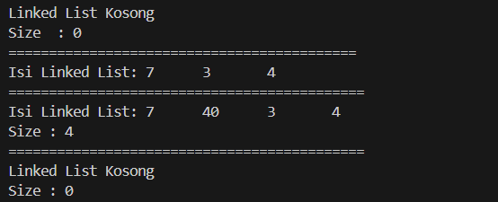
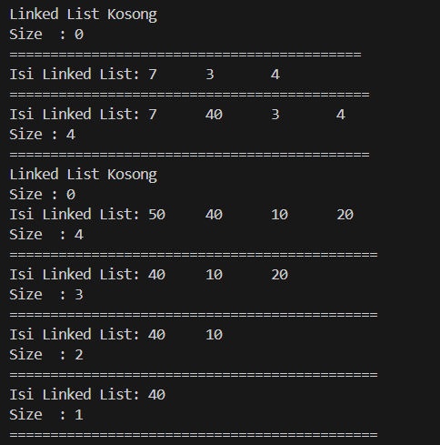

# <p align ="center"> LAPORAN PRAKTIKUM ALGORITMA DAN STRUKTUR DATA </p>

## <p align ="center"> PERTEMUAN IX <br> Double Linked List </p>

<br><br><br><br>

<p align="center">
    </p>

<br><br><br><br><br>

<p align = "center"> Nama  : Farhan Mawaludin </p>
<p align = "center"> NIM   : 2341720258 </p>
<p align = "center"> Prodi : TEKNIK INFORMATIKA</p>
<p align = "center"> Kelas : 1B </p>
<br><br>


# 12.2.1 Percobaan 1
<b>Kode Node11</b>

``` java
package Pertemuan12;

public class Node11 {
    int data;
    Node11 prev,next;

    Node11(Node11 prev, int data, Node11 next){
        this.prev = prev;
        this.data = data;
        this.next = next;
    }
}
```
<br><b>Kode doubleLinkedList</b>

```java
package Pertemuan12;


public class doubleLinkedList {
    Node11 head;
    int size;
    
    public doubleLinkedList() {
        head = null;
        size =0;
    }

    public boolean isEmpty(){
        return head == null;
    }

    public void addFirst(int item){
        if(isEmpty()){
            head = new Node11(null, item, head);
        }else{
            Node11 newNode = new Node11(null, item, head);
            head.prev = newNode;
            head = newNode;
        }
        size++;
    }

    public void addLast(int item){
        if(isEmpty()){
            addFirst(item);
        }else{
            Node11 current = head;
            while (current.next != null){
                current = current.next;
            }
            Node11 newNode = new Node11(current, item, null);
            current.next = newNode;
            size++;
        }    
    }

    public void add(int item, int index) throws Exception {
        if (isEmpty()) {
            addFirst(item);
        } else if (index < 0 || index > size) {
            throw new Exception("Nilai indeks di luar batas");
        } else {
            Node11 current = head;
            int i = 0;
            while (i < index) {
                current = current.next;
                i++;
            }
            if (current.prev == null){
                Node11 newNode = new Node11(null, item, current);
                current.prev = newNode;
                head = newNode;
            }else{
                Node11 newNode = new Node11(current.prev, item, current);
                newNode.prev = current.prev;
                newNode.next = current;
                current.prev.next = newNode;
                current.prev = newNode;
            }
        }
        size++;
    }

    public int size(){
        return size;
    }

    public void clear(){
        head = null;
        size = 0;
    }

    public void print(){
        if(!isEmpty()){
            Node11 tmp = head;
            System.out.print("Isi Linked List: ");
            while (tmp != null){
                System.out.print(tmp.data + "\t");
                tmp = tmp.next;
            }
            System.out.println();
        }else{
            System.out.println("Linked List Kosong");
        }
    }
}
```
<br><b>Kode doubleLinkedListMain</b>

``` java
package Pertemuan12;

public class DoubleLinkedListMain {
    public static void main(String[] args) throws Exception {
        doubleLinkedList dll = new doubleLinkedList();
        dll.print();
        System.out.println("Size  : " + dll.size());
        System.out.println("===========================================");
        dll.addFirst(3);
        dll.addLast(4);
        dll.addFirst(7);
        dll.print();
        System.out.println("============================================");
        dll.add(40, 1);
        dll.print();
        System.out.println("Size : " + dll.size());
        System.out.println("============================================");
        dll.clear();
        dll.print();
        System.out.println("Size : " + dll.size());
    }
}
```

<b>Output</b>




#  Pertanyaan Percobaan

1. Jelaskan perbedaan antara single linked list dengan double linked lists!<br>
Jawab : Single linked list hanya memiliki satu pointer, yaitu next, yang menunjukkan node selanjutnya. Double linked list memiliki dua pointer, next dan previous, yang menunjukkan node selanjutnya dan node sebelumnya.<br>
2. Perhatikan class Node, di dalamnya terdapat atribut next dan prev. Untuk apakah atribut tersebut?
Jawab : next digunakan sebagai pointer untuk node berikutnya, sedangkan prev digunakan sebagai pointer untuk node sebelumnya.
3. Perhatikan konstruktor pada class DoubleLinkedLists. Apa kegunaan inisialisasi atribut head dan size seperti pada gambar berikut ini?<br>
Jawab : Untuk menginisialisasi awal double linked list sebagai kosong.<br>
4. Pada method addFirst(), kenapa dalam pembuatan object dari konstruktor class Node prev dianggap sama dengan null?<br>
Jawab : Karena node pertama tidak memiliki node sebelumnya, sehingga prev bernilai null.<br>
5. Perhatikan pada method addFirst(). Apakah arti statement head.prev = newNode ?<br>
Jawab : Jika double linked list sudah berisi node, node baru yang ditambahkan di awal harus ditempatkan sebelum head saat ini, sehingga node baru menjadi head baru.<br>
6. Perhatikan isi method addLast(), apa arti dari pembuatan object Node dengan mengisikan parameter prev dengan current, dan next dengan null?
Jawab : Node baru ditambahkan di akhir list, sehingga next bernilai null karena tidak ada node setelahnya, dan prev menunjuk ke node terakhir saat ini.<br>
7. Pada method add(), terdapat potongan kode program sebagai berikut ... jelaskan maksud dari bagian yang ditandai dengan kotak kuning.<br>
Jawab : Kode pada method add() menangani penyisipan node baru di awal list, memastikan node baru menjadi head baru.


# 12.3.1 Percobaan 2

<b>Tambahan percobaan 2</b>

``` java
public void removeFirst() throws Exception {
    if (isEmpty()) {
        throw new Exception("Linked List masih kosong, tidak dapat dihapus");
    } else if (size == 1) {
        removeLast();
    } else {
        head = head.next;
        head.prev = null;
        size--;
        }
    }

public void removeLast() throws Exception {
    if (isEmpty()) {
        throw new Exception ("Linked List masih kosong, tidak dapat dihapus");
    } else if (head.next == null) {
        head = null;
        size--;
        return;
    }

    Node11 current = head;
    while (current.next.next != null) {
        current = current.next;
    }
    current.next = null;
    size--;
    }

public void removeAt(int index) throws Exception {
    if (isEmpty() || index >= size) {
        throw new Exception("Nilai indeks diluar batas");
    } else if (index == 0) {
        removeFirst();
    } else {
        Node11 current = head;
        int i = 0;
        while (i < index) {
            current = current.next;
            i++;
        }
        if (current.next == null) {
            current.prev.next= null;
        } else if (current.prev == null) {
            current = current.next;
            current.prev=null;
            head = current;
        } else {
            current.prev.next = current.next;
            current.next.prev = current.prev;
        }
        size--;
        }
    }
```

<br><b>tambahan di kelas main</b><br>

``` java
dll.addLast(50);
        dll.addLast(40);
        dll.addLast(10);
        dll.addLast(20);
        dll.print();
        System.out.println("Size  : " + dll.size());
        System.out.println("=============================================");
        dll.removeFirst();
        dll.print();
        System.out.println("Size  : " + dll.size());
        System.out.println("=============================================");
        dll.removeLast();
        dll.print();
        System.out.println("Size  : " + dll.size());
        System.out.println("=============================================");
        dll.removeAt(1);
        dll.print();
        System.out.println("Size  : " + dll.size());
        System.out.println("=============================================");
    }
```


<br><b>Output</b>

