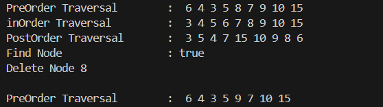

# <p align ="center"> LAPORAN PRAKTIKUM ALGORITMA DAN STRUKTUR DATA </p>

## <p align ="center"> PERTEMUAN IX <br> Tree </p>

<br><br><br><br>

<p align="center">
    </p>

<br><br><br><br><br>

<p align = "center"> Nama  : Farhan Mawaludin </p>
<p align = "center"> NIM   : 2341720258 </p>
<p align = "center"> Prodi : TEKNIK INFORMATIKA</p>
<p align = "center"> Kelas : 1B </p>
<br><br>

# 13.2.1 Percobaan 1
## node11

``` java
public class node11 {
    int data;
    node11 left;
    node11 right;

    public node11(){

    }

    public node11(int data) {
        this.left = null;
        this.data = data;
        this.right = null;
    }
}
```

## binaryTree11

``` java
public class binaryTree11 {
    node11 root;
    int size;

    public binaryTree11(){
        root = null;
    }

    boolean isEmpty(){
        return root == null;
    }

    void add(int data) {
        if (isEmpty()) {
            root = new node11(data);
        } else {
            node11 current = root;
            while (true) {
                if (data < current.data) {
                    if (current.left == null) {
                        current.left = new node11(data);
                        break;
                    } else {
                        current = current.left;
                    }
                } else if (data > current.data) {
                    if (current.right == null) {
                        current.right = new node11(data);
                        break;
                    } else {
                        current = current.right;
                    }
                } else {
                    break;
                }
            }
        }
    }

    boolean find (int data){
        node11 current = root;
        while (current != null) {
            if (current.data == data) {
                return true;
            } else if (data < current.data) {
                current = current.left;
            } else {
                current = current.right;
            }
        }
        return false;
    }

    void traversePreOrder(node11 node){
        if (node != null) {
            System.out.print(" " + node.data);
            traversePreOrder(node.left);
            traversePreOrder(node.right);
        }
    }

    void traversePostOrder(node11 node) {
        if (node != null) {
            traversePostOrder(node.left);
            traversePostOrder(node.right);
            System.out.print(" " + node.data);
        }
    }

    void traverseInOrder(node11 node){
        if (node != null) {
            traverseInOrder(node.left);
            System.out.print(" " + node.data);
            traverseInOrder(node.right);
        }
    }

    node11 getSuccessor(node11 del){
        node11 successor = del.right;
        node11 successorParent = del;
        while (successor.left != null) {
            successorParent = successor;
            successor = successor.left;
        }
        if (successor != del.right) {
            successorParent.left = successor.right;
            successor.right = del.right;
        }
        return successor;
    }

    void delete (int data){
        if (isEmpty()) {
            System.out.println("Tree is empty!");
            return;
        }
        //find node (current) that will be deleted
        node11 parent = root;
        node11 current = root;
        boolean isLeftChild = false;
        while (current != null) {
            if (current.data == data) {
                break;
            } else if (data < current.data) {
                parent = current;
                current = current.left;
                isLeftChild = true;
            } else if (data > current.data) {
                parent = current;
                current = current.right;
                isLeftChild = false;
            }
        }
        //deletion
        if (current == null) {
            System.out.println("Couldn't find data!");
            return;
        } else {
            //if there is no child, simply delete it
            if (current.left == null && current.right == null) {
                if (current == root) {
                    root = null;
                } else {
                    if (isLeftChild) {
                        parent.left = null;
                    } else {
                        parent.right = null;
                    }
                }
            } else if (current.left == null) {//if there is 1 child (right)
                if (current == root) {
                    root = current.right;
                } else {
                    if (isLeftChild) {
                        parent.left = current.right;
                    } else {
                        parent.right = current.right;
                    }
                }                
            } else if (current.right == null) {//if there is 1 child (left)
                if (current == root) {
                    root = current.left;
                } else {
                    if (isLeftChild) {
                        parent.left = current.left;
                    } else {
                        parent.right = current.left;
                    }
                }
            } else {//if rhere is 2 childs
                node11 successor = getSuccessor(current);
                if (current == root) {
                    root = successor;
                } else {
                    if (isLeftChild) {
                        parent.left = successor;
                    } else {
                        parent.right = successor;
                    }
                }
                successor.left = current.left;
            }
        }
    }
}
```

## binaryTreeMain11

``` java
public class binaryTreeMain11 {
    public static void main(String[] args) {
        binaryTree11 bt = new binaryTree11();
        bt.add(6);
        bt.add(4);
        bt.add(8);
        bt.add(3);
        bt.add(5);
        bt.add(7);
        bt.add(9);
        bt.add(10);
        bt.add(15);
        System.out.print("PreOrder Traversal        : ");
        bt.traversePreOrder(bt.root);
        System.out.println("");
        System.out.print("inOrder Traversal         : ");
        bt.traverseInOrder(bt.root);
        System.out.println("");
        System.out.print("PostOrder Traversal       : ");
        bt.traversePostOrder(bt.root);
        System.out.println("");
        System.out.println("Find Node                 : " + bt.find(5));
        System.out.println("Delete Node 8");
        bt.delete(8);
        System.out.println("");
        System.out.print("PreOrder Traversal        : ");
        bt.traversePreOrder(bt.root);
        System.out.println("");
    }
}
```

## Output



## 13.2.2 Pertanyaan Percobaan

1. Mengapa dalam binary search tree proses pencarian data bisa lebih efektif dilakukan dibanding
binary tree biasa?<br>
Jawab : Karena nilai di tree sebelah kiri itu lebih kecil dari pada disebelah kanan sehingga kemungkinan struktur seperti ini akan membuat perncarian data lebih efektif karena lebih tersruktur
2. Untuk apakah di class Node, kegunaan dari atribut left dan right?<br>
Jawab :left menunjuk ke node anak kiri, yang biasanya memiliki nilai lebih kecil dari node induknya.
right menunjuk ke node anak kanan, yang biasanya memiliki nilai lebih besar dari node induknya.
3. a. Untuk apakah kegunaan dari atribut root di dalam class BinaryTree?<br>
Jawab :digunakan untuk menyimpan referensi ke node pertama atau node utama dari pohon<br>
b. Ketika objek tree pertama kali dibuat, apakah nilai dari root?<br>
Jawab :null karena masih kosong<br>
4. Ketika tree masih kosong, dan akan ditambahkan sebuah node baru, proses apa yang akan terjadi?<br>
Jawab :Node baru tersebut akan menjadi root dari pohon,
Atribut root pada objek BinaryTree akan diatur untuk merujuk ke node baru,
Proses ini dapat dilihat pada metode add(int data), dimana jika isEmpty() mengembalikan true, node baru akan diinisialisasi dan diatur sebagai root.
5. Perhatikan method add(), di dalamnya terdapat baris program seperti di bawah ini. Jelaskan
secara detil untuk apa baris program tersebut?<br>
```java
if(data<current.data){
 if(current.left!=null){
 current = current.left;
 }else{
 current.left = new Node(data);
 break;
 }
}
```
Jawab :<br>
- if(data < current.data): Ini memeriksa apakah nilai data yang akan ditambahkan lebih kecil dari nilai node saat ini (current).
- if(current.left != null): Jika anak kiri dari node saat ini tidak null, maka current diperbarui untuk menunjuk ke anak kiri. Ini berarti kita melanjutkan pencarian ke sub-pohon kiri untuk menemukan lokasi yang tepat untuk node baru.
- current = current.left: Memperbarui current untuk menunjuk ke anak kiri, sehingga loop berikutnya akan memeriksa node di sub-pohon kiri.
- else: Jika anak kiri dari node saat ini adalah null, maka node baru dapat ditempatkan di posisi ini.
- current.left = new Node(data): Menginisialisasi node baru dengan data dan mengaturnya sebagai anak kiri dari node saat ini.
- break: Keluar dari loop karena node baru telah berhasil ditempatkan di posisi yang sesuai dalam tree.


# 13.3 Kegiatan Praktikum 2
## binaryTreeArray11
``` java
public class binaryTreeArray11 {
        int[] data;
        int idxLast;
    
        public binaryTreeArray11(){
            data = new int[10];
        }
    
        void populateData(int data[], int idxLast){
            this.data = data;
            this.idxLast = idxLast;
        }
    
        void traverseInOrder(int idxStart){
            if (idxStart <= idxLast) {
                traverseInOrder(2*idxStart+1);
                System.out.print(data[idxStart] + " ");
                traverseInOrder(2*idxStart+2);
            }
        }
    }
```
## binaryTreeArrayMain11
``` java
public class binaryTreeMain11 {
    public static void main(String[] args) {
        binaryTree11 bt = new binaryTree11();
        bt.add(6);
        bt.add(4);
        bt.add(8);
        bt.add(3);
        bt.add(5);
        bt.add(7);
        bt.add(9);
        bt.add(10);
        bt.add(15);
        System.out.print("PreOrder Traversal        : ");
        bt.traversePreOrder(bt.root);
        System.out.println("");
        System.out.print("inOrder Traversal         : ");
        bt.traverseInOrder(bt.root);
        System.out.println("");
        System.out.print("PostOrder Traversal       : ");
        bt.traversePostOrder(bt.root);
        System.out.println("");
        System.out.println("Find Node                 : " + bt.find(5));
        System.out.println("Delete Node 8");
        bt.delete(8);
        System.out.println("");
        System.out.print("PreOrder Traversal        : ");
        bt.traversePreOrder(bt.root);
        System.out.println("");
    }
}
```

## Output


## 13.3.2 Pertanyaan Percobaan
1. Apakah kegunaan dari atribut data dan idxLast yang ada di class BinaryTreeArray?<br>
Jawab :<br>
- data: Atribut ini adalah array yang menyimpan elemen-elemen dari binary tree. Setiap elemen dari array merepresentasikan node dalam tree.
- idxLast: Atribut ini menyimpan indeks dari elemen terakhir yang diisi dalam array data. Ini digunakan untuk menentukan batas traversal dan operasi lainnya pada tree.
2. Apakah kegunaan dari method populateData()?<br>
Jawab :digunakan untuk menginisialisasi array data dengan elemen-elemen yang diberikan sebagai argumen, serta mengatur nilai idxLast dengan indeks terakhir yang diisi.
3. Apakah kegunaan dari method traverseInOrder()?<br>
Jawab :digunakan untuk melakukan traversal in-order pada binary tree. Traversal in-order mengunjungi node-node dalam urutan: kiri, root, kanan.
4. Jika suatu node binary tree disimpan dalam array indeks 2, maka di indeks berapakah posisi
left child dan rigth child masin-masing?<br>
Jawab :<br>
untuk node pada indeks 2:
- Left child berada pada indeks 2*2 + 1 = 5.
- Right child berada pada indeks 2*2 + 2 = 6.
5. Apa kegunaan statement int idxLast = 6 pada praktikum 2 percobaan nomor 4?<br>
Jawab :digunakan untuk mengatur nilai idxLast dalam objek binaryTreeArray11,ini menunjukkan bahwa indeks terakhir yang diisi dalam array data adalah 6.

# 13.4 Tugas Praktikum
1. Buat method di dalam class BinaryTree yang akan menambahkan node dengan cara
rekursif.<br>
Jawab : <br>
``` java
void tambahRekursif(node11 current, int data) { // penambahan pada method tambah secara rekursif
        if (current == null) {
            current = new node11(null, data, null); // tugas 1
        } else {
            if (data < current.data) {
                if (current.left != null) {
                    tambahRekursif(current.left, data);
                } else {
                    current.left = new node11(null, data, null);
                }
            } else if (data > current.data) {
                if (current.right != null) {
                    tambahRekursif(current.right, data);
                } else {
                    current.right = new node11(null, data, null);
                }
            }
        }
    }
```
2. Buat method di dalam class BinaryTree untuk menampilkan nilai paling kecil dan yang
paling besar yang ada di dalam tree.<br>
Jawab :<br>
``` java
int findMin() { //tugas 2
        node11 current = root;
        while (current.left != null) {
            current = current.left;
        }
        return current.data;
    }

    int findMax() {
        node11 current = root;
        while (current.right != null) {
            current = current.right;
        }
        return current.data;
    }
``` 

3. Buat method di dalam class BinaryTree untuk menampilkan data yang ada di leaf.<br>
Jawab : <br>
``` java 
void tampilLeaf(node11 node) { // tugas 3
        if (node != null) {
            if (node.left == null && node.right == null) {
                System.out.print(" " + node.data);
            } else {
                tampilLeaf(node.left);
                tampilLeaf(node.right);
            }
        }
    }
```
4. Buat method di dalam class BinaryTree untuk menampilkan berapa jumlah leaf yang ada
di dalam tree.<br>
Jawab : <br>
``` java
int tampilJumlahLeaf(node11 node) { // tugas 4
        if (node == null) {
            return 0;
        } else if (node.left == null && node.right == null) {
            System.out.println(" " + node.data);
            return 1;
        } else {
            return tampilJumlahLeaf(node.left) + tampilJumlahLeaf(node.right);
        }
    }
```
5. Modifikasi class BinaryTreeArray, dan tambahkan :
- method add(int data) untuk memasukan data ke dalam tree
Jawab :<br>
``` java
void add(int data) {
            // cek penuh atau tidak
            if (idxLast == this.data.length - 1) {
                System.out.println("The Tree is Full");
                return;
            }
            idxLast++;
            this.data[idxLast] = data;
        }
```

- method traversePreOrder() dan traversePostOrder()
Jawab : <br>
``` java
void traversePreOrder(int idxStart) {
            if (idxStart <= idxLast) {
                System.out.print(this.data[idxStart] + " ");
                traversePreOrder(2 * idxStart + 1);
                traversePreOrder(2 * idxStart + 2);
            }
        }
    
        void traversePostOrder(int idxStart) {
            if (idxStart <= idxLast) {
                traversePostOrder(2 * idxStart + 1);
                traversePostOrder(2 * idxStart + 2);
                System.out.print(this.data[idxStart] + " ");
            }
        }
```