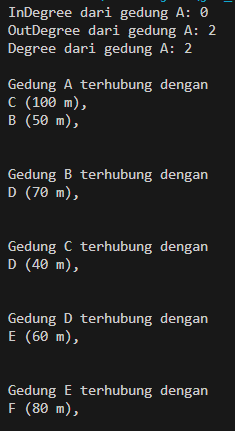
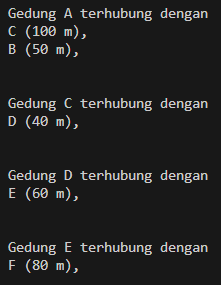
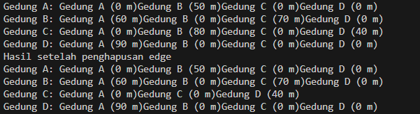

# <p align ="center"> LAPORAN PRAKTIKUM ALGORITMA DAN STRUKTUR DATA </p>

## <p align ="center"> PERTEMUAN XV <br> Graph </p>

<br><br><br><br>

<p align="center">
    </p>

<br><br><br><br><br>

<p align = "center"> Nama  : Farhan Mawaludin </p>
<p align = "center"> NIM   : 2341720258 </p>
<p align = "center"> Prodi : TEKNIK INFORMATIKA</p>
<p align = "center"> Kelas : 1B </p>
<br><br>

# 2.1 Percobaan 1: Implementasi Graph menggunakan Linked List

## Kode node11
``` java
package coba;
public class node11 {
    int data;
    node11 prev, next;
    int jarak;

    node11(node11 prev, int data, int jarak, node11 next){
        this.prev = prev;
        this.data = data;
        this.next = next;
        this.jarak = jarak;
        
    }
    
}
```

## Kode doubleLinkedList11
``` java
package coba;
public class doubleLinkedList11 {
    node11 head;
    int size;
    
    public doubleLinkedList11() {
        head = null;
        size =0;
    }

    public boolean isEmpty(){
        return head == null;
    }

    public void addFirst(int item , int jarak){
        if(isEmpty()){
            head = new node11(null, item, jarak,null);
        }else{
            node11 newnode11 = new node11(null, item, jarak,head);
            head.prev = newnode11;
            head = newnode11;
        }
        size++;
    }

    
    public int size(){
        return size;
    }

    public void clear(){
        head = null;
        size = 0;
    }

    public void print(){
        if(!isEmpty()){
            node11 tmp = head;
            System.out.print("Isi Linked List: ");
            while (tmp != null){
                System.out.print(tmp.data + "\t");
                tmp = tmp.next;
            }
            System.out.println("Berhasil diisi");
        }else{
            System.out.println("Linked List Kosong");
        }
    }

    public int get(int index) throws Exception {
        if (isEmpty() || index >= size) {
            throw new Exception ("Nilai indeks diluar batas");
        } 
            node11 tmp = head;
            for (int i = 0; i < index; i++) {
                tmp = tmp.next;
            }
            return tmp.data;
        
    }


    // method getindex
    public int getJarak(int index) throws Exception {
        if (isEmpty() || index >= size) {
            throw new Exception ("Nilai indeks diluar batas");
        } 
            node11 tmp = head;
            for (int i = 0; i < index; i++) {
                tmp = tmp.next;
            }
            return tmp.jarak;
        
    }

    public void remove(int index) throws Exception {
        node11 current = head;
        while (current != null){
            if (current.data == index){
                if (current.prev != null){
                    current.prev.next = current.next;
                }else{
                    head = current.next;
                }

                if (current.next != null){
                    current.next.prev = current.prev;
                }
                break;
            }
            current = current.next;
        }
        size--;
    }
}
```

## Kode graph11
``` java
package coba;
public class graph11 {
    int vertex;
    doubleLinkedList11 list[];

    public graph11(int v) {
        vertex = v; 
        list = new doubleLinkedList11[v];
        for (int i = 0; i < v; i++) {
            list[i] = new doubleLinkedList11();
        }
    }

    public void addEdge(int asal, int tujuan, int jarak) {
        list[asal].addFirst(tujuan, jarak);
        //list[tujuan].addFirst(asal, jarak);
    }

    public void degree(int asal) throws Exception{
        int k, totalIn = 0, totalOut=0;
        for ( int i= 0; i < vertex; i++) {
            //inDegree
            for (int j = 0 ; j <list[i].size(); j++){
                if (list [i].get(j)==asal){
                    ++totalIn;
                }
            }

            //outDegree
            for (k =0; k<list[asal].size();k++){
                list[asal].get(k);
            }
            totalOut = k;
        }    
        System.out.println("InDegree dari gedung " + (char) ('A' + asal) + ": " + totalIn);
        System.out.println("OutDegree dari gedung " + (char) ('A' + asal) + ": " + totalOut);
        System.out.println("Degree dari gedung " + (char) ('A' + asal) + ": " + (totalIn+totalOut));
       // System.out.println("OutDegree dari gedung " + (char) ('A' + asal) + ": " + list[asal].size());
        
    }

    public void removeEdge(int asal, int tujuan)throws Exception{
        for(int i = 0; i<vertex;i++){
            if (i == tujuan){
                list[asal].remove(tujuan);
            }
        }
    }
    public void removeAll(){
        for(int i = 0; i<vertex;i++){
            list[i].clear();
        }
        System.out.println("Graf berhasil dikosongkan");
    }

    public void printGraph() throws Exception{
        for(int i = 0; i<vertex;i++){
            if (list[i].size() > 0){
                System.out.println("");
                System.out.println("Gedung " + (char)('A' + i) + " terhubung dengan");
                for (int j = 0; j < list[i].size(); j++){
                    System.out.println((char)('A' + list[i].get(j)) + " (" + list[i].getJarak(j) + " m), ");
                }
                System.out.println("");
            }
        }
        System.out.println("");
    }
}
```

## Kode graphMain11
``` java
package coba;
public class graphMain11 {
    public static void main(String[] args) throws Exception {
        graph11 gedung = new graph11(6);

        gedung.addEdge(0, 1, 50);
        gedung.addEdge(0, 2, 100);
        gedung.addEdge(1, 3, 70);
        gedung.addEdge(2, 3, 40);
        gedung.addEdge(3, 4, 60);
        gedung.addEdge(4, 5, 80);
        gedung.degree(0);
        gedung.printGraph();
        
        gedung.removeEdge(1, 3);
        gedung.printGraph();
    }
}
```


## Output
1.  <br>
2. 

## 2.1.3 Pertanyaan
1. Perbaiki kode program Anda apabila terdapat error atau hasil kompilasi kode tidak sesuai!<br>
Jawab :
2. Pada class Graph, terdapat atribut list[] bertipe DoubleLinkedList. Sebutkan tujuan pembuatan
variabel tersebut!<br>
Jawab : Variabel list[] bertipe DoubleLinkedList11 digunakan untuk merepresentasikan adjacency list dari graf.
3. Jelaskan alur kerja dari method removeEdge!<br>
Jawab : Method removeEdge berfungsi untuk menghapus edge antara dua node dalam graf. Alur kerjanya adalah dengan menerima parameter asal dan tujuan yang merepresentasikan node asal dan tujuan dari edge yang akan dihapus. Kemudian, method ini memanggil method remove pada linked list yang sesuai dengan node asal untuk menghapus node tujuan. Method remove pada doubleLinkedList11 mencari node dengan nilai data yang sesuai dengan tujuan, lalu menghapus node tersebut dari linked list dengan mengatur ulang pointer prev dan next dari node tetangga.
4. Apakah alasan pemanggilan method addFirst() untuk menambahkan data, bukan method add
jenis lain saat digunakan pada method addEdge pada class Graph?<br>
Jawab : Efisiensi waktu
5. Modifikasi kode program sehingga dapat dilakukan pengecekan apakah terdapat jalur antara
suatu node dengan node lainnya, seperti contoh berikut (Anda dapat memanfaatkan Scanner).<br>
Jawab : <br>
- Kode modifikasi di graph11
``` java
 public boolean tetangga(int asal, int tujuan) throws Exception {
        for (int i = 0; i < list[asal].size(); i++) {
            if (list[asal].get(i) == tujuan) {
                return true;
            }
        }
        return false;
    }
```

- Kode Modifikasi di graphMain11
``` java
Scanner scanner = new Scanner(System.in);
        
        System.out.print("Masukkan gedung asal: ");
        int asal = scanner.nextInt();
        System.out.print("Masukkan gedung tujuan: ");
        int tujuan = scanner.nextInt();
        
        boolean tetangga = gedung.tetangga(asal, tujuan);
        char gedungAsal = (char) ('A' + asal);
        char gedungTujuan = (char) ('A' + tujuan);
        
        if (tetangga) {
            System.out.println("Gedung " + gedungAsal + " dan " + gedungTujuan + " bertetangga");
        } else {
            System.out.println("Gedung " + gedungAsal + " dan " + gedungTujuan + " tidak bertetangga");
        }

        scanner.close();
```

# 2.2 Percobaan 2: Implementasi Graph menggunakan Matriks
## Kode graphMatriks11
``` java
package coba;

public class graphMatriks11 {
    int vertex;
    int[][] matriks;

    public graphMatriks11(int v){
        vertex = v;
        matriks = new int[v][v];
    }

    public void makeEdge( int asal, int tujuan, int jarak){
        matriks[asal][tujuan] = jarak;
    }

    public void removeEdge (int asal, int tujuan){
        matriks[asal][tujuan] = -1;
    }

    public void printGraph(){
        for (int i = 0; i < vertex; i++){
            System.out.print("Gedung " + (char) ('A' + i) +": ");
            for (int j = 0; j < vertex; j++){
                if (matriks[i][j] != -1){
                    System.out.print("Gedung " + (char) ('A' + j) + " (" + matriks[i][j] + " m)");
                }
            }
            System.out.println();
        }
    }
}
```

## Output


## 2.2.3 Pertanyaan
1. Perbaiki kode program Anda apabila terdapat error atau hasil kompilasi kode tidak sesuai!<br>
Jawab :
2. Apa jenis graph yang digunakan pada Percobaan 2?<br>
Jawab : Jenis graph yang digunakan adalah graph berarah (directed graph), di mana setiap edge memiliki arah dari satu vertex ke vertex lainnya.
3. Apa maksud dari dua baris kode berikut? <br>
Jawab : Dua baris kode ini membuat dua edge berbeda antara vertex 1 dan vertex 2 dengan jarak yang berbeda. Edge pertama menghubungkan vertex 1 ke vertex 2 dengan jarak 70, sedangkan edge kedua menghubungkan vertex 2 ke vertex 1 dengan jarak 80.
4. Modifikasi kode program sehingga terdapat method untuk menghitung degree, termasuk
inDegree dan outDegree!<br>
Jawab :<br>
- modifikasi degree
``` java
public int inDegree(int vertex) {
        int inDegree = 0;
        for (int i = 0; i < this.vertex; i++) {
            if (matriks[i][vertex] != -1) {
                inDegree++;
            }
        }
        return inDegree;
    }


    public int outDegree(int vertex) {
        int outDegree = 0;
        for (int i = 0; i < this.vertex; i++) {
            if (matriks[vertex][i] != -1) {
                outDegree++;
            }
        }
        return outDegree;
    }

    
    public int degree(int vertex) {
        return inDegree(vertex) + outDegree(vertex);
    }
}
```

# 3. Latihan Praktikum
1. Modifikasi kode program pada class GraphMain sehingga terdapat menu program yang bersifat
dinamis, setidaknya terdiri dari:
- Add Edge
- Remove Edge
- Degre Print Graph
- Cek Edge
Pengguna dapat memilih menu program melalui input Scanner<br>
Jawab :<br>
``` java
public class graphMain11 {
    public static void main(String[] args) throws Exception {
        Scanner scanner = new Scanner(System.in);
        System.out.print("Masukkan jumlah gedung: ");
        int jumlahGedung = scanner.nextInt();

        graph11 gedung = new graph11(jumlahGedung);

        boolean exit = false;
        while (!exit) {
            System.out.println("\nMenu Program:");
            System.out.println("1. Add Edge");
            System.out.println("2. Remove Edge");
            System.out.println("3. Degree");
            System.out.println("4. Print Graph");
            System.out.println("5. Check Edge");
            System.out.println("6. Exit");
            System.out.print("Pilih menu: ");
            int pilihan = scanner.nextInt();

            switch (pilihan) {
                case 1:
                    System.out.print("Masukkan gedung asal: ");
                    int asalAdd = scanner.nextInt();
                    System.out.print("Masukkan gedung tujuan: ");
                    int tujuanAdd = scanner.nextInt();
                    System.out.print("Masukkan bobot edge: ");
                    int bobotAdd = scanner.nextInt();
                    gedung.addEdge(asalAdd, tujuanAdd, bobotAdd);
                    break;
                case 2:
                    System.out.print("Masukkan gedung asal: ");
                    int asalRemove = scanner.nextInt();
                    System.out.print("Masukkan gedung tujuan: ");
                    int tujuanRemove = scanner.nextInt();
                    gedung.removeEdge(asalRemove, tujuanRemove);
                    break;
                case 3:
                    System.out.print("Masukkan gedung: ");
                    int gedungDegree = scanner.nextInt();
                    gedung.degree(gedungDegree);
                    break;
                case 4:
                    gedung.printGraph();
                    break;
                case 5:
                    System.out.print("Masukkan gedung asal: ");
                    int asalCheck = scanner.nextInt();
                    System.out.print("Masukkan gedung tujuan: ");
                    int tujuanCheck = scanner.nextInt();
                    boolean tetangga = gedung.tetangga(asalCheck, tujuanCheck);
                    char gedungAsal = (char) ('A' + asalCheck);
                    char gedungTujuan = (char) ('A' + tujuanCheck);
                    if (tetangga) {
                        System.out.println("Gedung " + gedungAsal + " dan " + gedungTujuan + " bertetangga");
                    } else {
                        System.out.println("Gedung " + gedungAsal + " dan " + gedungTujuan + " tidak bertetangga");
                    }
                    break;
                case 6:
                    exit = true;
                    break;
                default:
                    System.out.println("Pilihan tidak valid.");
            }
        }

        scanner.close();
```

2. Tambahkan method updateJarak pada Percobaan 1 yang digunakan untuk mengubah jarak
antara dua node asal dan tujuan!<br>
Jawab : <br>
``` java
public void updateJarak(int asal, int tujuan, int jarakBaru) {
        try {
            int index = -1;
            // Mencari index tujuan di dalam list[asal]
            for (int i = 0; i < list[asal].size(); i++) {
                if (list[asal].get(i) == tujuan) {
                    index = i;
                    break;
                }
            }
            if (index != -1) {
                // Update jarak
                list[asal].setJarak(index, jarakBaru);
                System.out.println("Jarak antara Gedung " + (char) ('A' + asal) + " dan Gedung " + (char) ('A' + tujuan)
                        + " berhasil diupdate menjadi " + jarakBaru + " m");
            } else {
                System.out.println(
                        "Gedung " + (char) ('A' + asal) + " tidak terhubung dengan Gedung " + (char) ('A' + tujuan));
            }
        } catch (Exception e) {
            System.out.println(e.getMessage());
        }
    }
```

3. Tambahkan method hitungEdge untuk menghitung banyaknya edge yang terdapat di dalam graf!<br>
Jawab :<br>
``` java
public int hitungEdge() {
        int totalEdge = 0;
        for (int i = 0; i < vertex; i++) {
            totalEdge += list[i].size();
        }
        return totalEdge;
    }
```