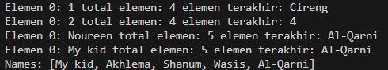

# <p align ="center"> LAPORAN PRAKTIKUM ALGORITMA DAN STRUKTUR DATA </p>

## <p align ="center"> PERTEMUAN XVI <br> Collection </p>

<br><br><br><br>

<p align="center">
    </p>

<br><br><br><br><br>

<p align = "center"> Nama  : Farhan Mawaludin </p>
<p align = "center"> NIM   : 2341720258 </p>
<p align = "center"> Prodi : TEKNIK INFORMATIKA</p>
<p align = "center"> Kelas : 1B </p>
<br><br>

# 16.2. Kegiatan Praktikum 1
## Kode ContohList
``` java
package Pertemuan16;

import java.util.ArrayList;
import java.util.LinkedList;
import java.util.List;

public class ContohList {
    public static void main(String[] args) {

        List l = new ArrayList();
        l.add(1);
        l.add(2);
        l.add(3);
        l.add("Cireng");

        
        System.out.printf("Elemen 0: %d total elemen: %d elemen terakhir: %s\n", l.get(0), l.size(), l.get(l.size() - 1));
        
        l.remove(0);

        l.add(4);

        System.out.printf("Elemen 0: %s total elemen: %d elemen terakhir: %s\n", l.get(0), l.size(), l.get(l.size() - 1));

        List<String> names = new LinkedList<>();
        names.add("Noureen");
        names.add("Akhlema");
        names.add("Shanum");
        names.add("Wasis");
        names.add("Al-Qarni");

        System.out.printf("Elemen 0: %s total elemen: %s elemen terakhir: %s\n", names.get(0), names.size(), names.get(names.size() - 1));

        names.set(0, "My kid");

        System.out.printf("Elemen 0: %s total elemen: %s elemen terakhir: %s\n", names.get(0), names.size(), names.get(names.size() - 1));
        System.out.println("Names: " + names.toString());
    }
}
```
## Output


## 16.2.3. Pertanyaan Percobaan
1. Perhatikan baris kode 25-36, mengapa semua jenis data bisa ditampung ke dalam sebuah
Arraylist?<br>
Jawab :  karena menggunakan tipe mentah Object ketika tipe generik tidak ditentukan.
2. Modifikasi baris kode 25-36 seingga data yang ditampung hanya satu jenis atau spesifik tipe
tertentu!<br>
Jawab :<br>
``` java
 List<Integer> l = new ArrayList<>();
        l.add(1);
        l.add(2);
        l.add(3);
        l.add(4);
        
        System.out.printf("Elemen 0: %d total elemen: %d elemen terakhir: %d\n", l.get(0), l.size(), l.get(l.size() - 1));
```
3. Ubah kode pada baris kode 38 menjadi seperti ini<br>
Jawab :
``` java
LinkedList<String> names = new LinkedList<>();
```
4. Tambahkan juga baris berikut ini, untuk memberikan perbedaan dari tampilan yang sebelumnya<br>
Jawab :
``` java
names.push("Mei-mei!");
        System.out.printf("Elemen 0: %s total elemen: %s elemen terakhir: %s\n", names.getFirst(), names.size(), names.getLast());
        System.out.println("Names: " + names.toString());
```
5. Dari penambahan kode tersebut, silakan dijalankan dan apakah yang dapat Anda jelaskan!<br>
Jawab : kode ini akan menampilkan konten terbaru dari daftar names dan menunjukkan bagaimana elemen dapat ditambahkan ke depan LinkedList dan bagaimana daftar diperbarui sesuai. Ini menunjukkan sifat dinamis dari LinkedList dan bagaimana ia mengelola elemennya dengan efisien.


# 16.3. Kegiatan Praktikum 2
## Kode LoopCollection
``` java
package Pertemuan16;

import java.util.Iterator;
import java.util.Stack;

public class LoopCollection {
    public static void main(String[] args) {
        
        Stack<String> fruits = new Stack<>();
        
    
        fruits.push("Banana");
        fruits.add("Orange");
        fruits.add("Watermelon");
        fruits.add("Leci");
        fruits.push("Salak");
        
        for (String fruit : fruits) {
            System.out.printf("%s ", fruit);
        }

        System.out.println("\n" + fruits.toString());

        
        while (!fruits.empty()) {
            System.out.printf("%s ", fruits.pop());
        }

        System.out.println("\n"); 

       
        fruits.push("Melon");
        fruits.push("Durian");

      
        for (Iterator<String> it = fruits.iterator(); it.hasNext();) {
            String fruit = it.next();
            System.out.printf("%s ", fruit);
        }

        System.out.println("\n");

        fruits.stream().forEach(e -> System.out.printf("%s ", e));

        System.out.println("\n");

      
        for (int i = 0; i < fruits.size(); i++) {
            System.out.printf("%s ", fruits.get(i));
        }
    }
}
```
## Output


## 16.3.3. Pertanyaan Percobaan
1. Apakah perbedaan fungsi push() dan add() pada objek fruits?<br>
Jawab : 
- push(): Menambahkan elemen ke puncak stack.
- add(): Menambahkan elemen ke posisi akhir dalam list yang diimplementasikan oleh stack.
2. Silakan hilangkan baris 43 dan 44, apakah yang akan terjadi? Mengapa bisa demikian?<br>
Jawab : Elemen "Melon" dan "Durian" akan ditambahkan ke stack fruits. Ini terjadi karena metode push digunakan untuk menambahkan elemen ke puncak stack.
3. Jelaskan fungsi dari baris 46-49?<br>
Jawab : untuk mencetak setiap elemen di stack fruits
4. Silakan ganti baris kode 25, Stack<String> menjadi List<String> dan apakah yang terjadi?
Mengapa bisa demikian?<br>
Jawab : terjadi eror karena berubah menjadi arraylist
5. Ganti elemen terakhir dari dari objek fruits menjadi “Strawberry”!<br>
Jawab :
``` java
 if (fruits.size() > 1) {
            fruits.set(1, "Strawberry");
        }

        System.out.println("\nAfter adding more fruits:");
        for (String fruit : fruits) {
            System.out.printf("%s ", fruit);
```
6. Tambahkan 3 buah seperti “Mango”,”guava”, dan “avocado” kemudian dilakukan sorting!<br>
Jawab :
``` java
fruits.push("Mango");
        fruits.push("Guava");
        fruits.push("Avocado");

        // Menampilkan elemen-elemen yang baru ditambahkan
        System.out.println("\nAfter adding more fruits:");
        for (String fruit : fruits) {
            System.out.printf("%s ", fruit);
```

# 16.4. Kegiatan Praktikum 3
## Kode Mahasiswa
``` java
package Pertemuan16;

class Mahasiswa {
    String nim;
    String nama;
    String notelp;

    public Mahasiswa(String nim, String nama, String notelp) {
        this.nim = nim;
        this.nama = nama;
        this.notelp = notelp;
    }

 
    public String toString() {
        return "Mahasiswa{nim='" + nim + "', nama='" + nama + "', notelp='" + notelp + "'}";
    }
}
```
## Kode ListMahasiswa
``` java
package Pertemuan16;

import java.util.ArrayList;

public class ListMahasiswa {
    private ArrayList<Mahasiswa> mahasiswas;

    public ListMahasiswa() {
        this.mahasiswas = new ArrayList<>();
    }

    public void tambah(Mahasiswa mhs) {
        mahasiswas.add(mhs);
    }

    public void hapus(int index) {
        mahasiswas.remove(index);
    }

    public void update(int index, Mahasiswa mhs) {
        mahasiswas.set(index, mhs);
    }

    public void tampil() {
        mahasiswas.stream().forEach(mhs -> {
            System.out.println(mhs.toString());
        });
    }

    public int linearSearch(String nim) {
        for (int i = 0; i < mahasiswas.size(); i++) {
            if (nim.equals(mahasiswas.get(i).nim)) {
                return i;
            }
        }
        return -1;
    }

    public void updateMahasiswa(String nim, Mahasiswa newMhs) {
        int index = linearSearch(nim);
        if (index != -1) {
            update(index, newMhs);
        } else {
            System.out.println("Mahasiswa with NIM " + nim + " not found.");
        }
    }

    public static void main(String[] args) {
        ListMahasiswa lm = new ListMahasiswa();

        Mahasiswa m = new Mahasiswa("201234", "Noureen", "021xx1");
        Mahasiswa m1 = new Mahasiswa("201235", "Akhleema", "021xx2");
        Mahasiswa m2 = new Mahasiswa("201236", "Shannum", "021xx3");

        // menambahkan objek mahasiswa
        lm.tambah(m);
        lm.tambah(m1);
        lm.tambah(m2);

        // menampilkan list mahasiswa
        lm.tampil();

        // update mahasiswa
        lm.update(lm.linearSearch("201235"), new Mahasiswa("201235", "Akhleema Lela", "021xx2"));
        System.out.println("");
        lm.tampil();
    }
}
```

## Output


## 16.4.3. Pertanyaan Percobaan
1. Pada fungsi tambah() yang menggunakan unlimited argument itu menggunakan konsep apa? Dan kelebihannya apa?<br>
Jawab : Fungsi tambah() yang menggunakan unlimited argument itu menggunakan konsep varargs (variable-length arguments) di Java. Dengan varargs, kita dapat mengirimkan sejumlah argumen yang berbeda ke sebuah metode, yang semuanya akan dikumpulkan dalam sebuah array.
2. Pada fungsi linearSearch() di atas, silakan diganti dengan fungsi binarySearch() dari collection!<br>
Jawab : 
``` java
public int binarySearch(String nim) {
        Collections.sort(mahasiswas, Comparator.comparing(m -> m.nim));
        return Collections.binarySearch(mahasiswas, new Mahasiswa(nim, "", ""), Comparator.comparing(m -> m.nim));
    }
```
3. Tambahkan fungsi sorting baik secara ascending ataupun descending pada class tersebut!<br>
Jawab : 
``` java
public void sortAscending() {
        Collections.sort(mahasiswas, Comparator.comparing(m -> m.nim));
    }

    public void sortDescending() {
        Collections.sort(mahasiswas, Comparator.comparing(Mahasiswa::getNim).reversed());
    }
```
