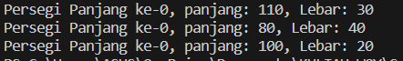
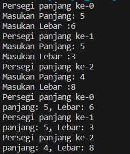
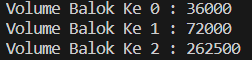

# <p align ="center"> LAPORAN PRAKTIKUM ALGORITMA DAN STRUKTUR DATA </p>

## <p align ="center"> PERTEMUAN II <br> OBJECT </p>

<br><br><br><br>

<p align="center">
    </p>

<br><br><br><br><br>

<p align = "center"> Nama  : Farhan Mawaludin </p>
<p align = "center"> NIM   : 2341720258 </p>
<p align = "center"> Prodi : TEKNIK INFORMATIKA</p>
<p align = "center"> Kelas : 1B </p>
<br><br>

## 3.2 Percobaan 1: Membuat Array dari Object, Mengisi dan Menampilkan

### 3.2.1 Langkah-langkah Percobaan

#### Buat class PersegiPanjang

```java
public class PersegiPanjang {
    public int panjang;
    public int lebar;

   }
```

#### Pada fungsi main yaitu pada class ArrayObjects, buatlah array PersegiPanjang yang berisi 3 elemen

```java
public class ArrayObjects11 {
    public static void main(String[] args) {
        PersegiPanjang[] ppArray = new PersegiPanjang[3];

        ppArray[0] = new PersegiPanjang();
        ppArray[0].panjang = 110;
        ppArray[0].lebar =30;

        ppArray[1]= new PersegiPanjang();
        ppArray[1].panjang=80;
        ppArray[1].lebar=40;

        ppArray[2]= new PersegiPanjang();
        ppArray[2].panjang=100;
        ppArray[2].lebar=20;

        System.out.println("Persegi Panjang ke-0, panjang: " + ppArray[0].panjang + ", Lebar: " + ppArray[0].lebar);
        System.out.println("Persegi Panjang ke-0, panjang: " + ppArray[1].panjang + ", Lebar: " + ppArray[1].lebar);
        System.out.println("Persegi Panjang ke-0, panjang: " + ppArray[2].panjang + ", Lebar: " + ppArray[2].lebar);

    }

}
```

#### Cetak ke layar semua atribut dari objek ppArray

```java
        System.out.println("Persegi Panjang ke-0, panjang: " + ppArray[0].panjang + ", Lebar: " + ppArray[0].lebar);
        System.out.println("Persegi Panjang ke-0, panjang: " + ppArray[1].panjang + ", Lebar: " + ppArray[1].lebar);
        System.out.println("Persegi Panjang ke-0, panjang: " + ppArray[2].panjang + ", Lebar: " + ppArray[2].lebar);
```

### 3.2.2 Verifikasi Hasil Percobaan



### 3.2.3 Pertanyaan

1. Berdasarkan uji coba 3.2, apakah class yang akan dibuat array of object harus selalu memiliki atribut dan sekaligus method?Jelaskan! <br>
   Jawab : Tidak, walaupun class PersegiPanjang tidak memiliki method yang didefinisikan di dalamnya, kita masih dapat membuat array of objects dan menggunakan objek-objek tersebut.
2. Apakah class PersegiPanjang memiliki konstruktor?Jika tidak, kenapa dilakukan pemanggilan konstruktur pada baris program berikut :<br>
   ppArray[1]= new PersegiPanjang();<br>
   Jawab : Tidak, itu adalah pemanggilan konstruktor default karena tidak ada konstruktor yang didefinisikan di dalam class
3. Apa yang dimaksud dengan kode berikut ini:<br> PersegiPanjang[] ppArray = new PersegiPanjang[3]; <br>
   Jawab : Baris kode tersebut adalah deklarasi dan inisialisasi sebuah array dari objek-objek PersegiPanjang
4. Apa yang dimaksud dengan kode berikut ini: <br>
   ppArray[1]= new PersegiPanjang();<br>
   ppArray[1].panjang=80;<br>
   ppArray[1].lebar=40;<br>
   Jawab : baris kode tersebut, kita membuat sebuah objek PersegiPanjang, kemudian mengatur nilai panjang dan lebar dari objek tersebut

5. Mengapa class main dan juga class PersegiPanjang dipisahkan pada uji coba 3.2?<br>
   Jawab : dalam pengembangan perangkat lunak ini membantu dalam keterbacaan, pemeliharaan, dan pengembangan proyek yang lebih besar dan kompleks.

## 3.3 Percobaan 2: Menerima Input Isian Array Menggunakan Looping

### 3.3.1 Langkah-langkah Percobaan

```java

package Pertemuan3.code;
import java.util.Scanner;
public class PersegiPanjangMain {
    public static void main(String[] args) {
        Scanner sc = new Scanner(System.in);
        PersegiPanjang[] ppArray = new PersegiPanjang[3];

        for(int i=0; i<3;i++){
            ppArray[i] = new PersegiPanjang();
            System.out.println("Persegi panjang ke-" + i);
            System.out.print("Masukan Panjang: ");
            ppArray[i].panjang= sc.nextInt() ;
            System.out.print("Masukan Lebar :");
            ppArray[i].lebar = sc.nextInt();

        }

        for(int i=0;i<3;i++){
            System.out.println("Persegi panjang ke-"+i);
            System.out.println("panjang: " + ppArray[i].panjang + ", Lebar: " + ppArray[i].lebar);
        }

    }

}
```

### 3.3.2 Verifikasi Hasil Percobaan



### 3.3.3 Pertanyaan

1. Apakah array of object dapat diimplementasikan pada array 2 Dimensi?<br>
   Jawab : Ya
2. Jika jawaban soal no satu iya, berikan contohnya! Jika tidak, jelaskan!<br>
   Jawab : Setiap mahasiswa memiliki beberapa atribut seperti nama, nim, dan mata kuliah yang diambil. Kita akan menggunakan array 2 dimensi untuk menyimpan data mahasiswa, di mana setiap baris akan mewakili satu mahasiswa dan setiap kolom akan mewakili atribut-atribut dari mahasiswa tersebut.

3. Jika diketahui terdapat class Persegi yang memiliki atribut sisi bertipe integer, maka kode dibawah ini akan memunculkan error saat dijalankan. Mengapa?<br>
   Jawab : Karena belum dibuat objek Persegi
4. Modifikasi kode program pada praktikum 3.3 agar length array menjadi inputan dengan Scanner!<br>
   Jawab :

```java
package Pertemuan3.code;
import java.util.Scanner;
public class ArrayObjects11 {
    public static void main(String[] args) {
        Scanner sc = new Scanner(System.in);

        System.out.print("Masukan Panjang Array : ");
        int length = sc.nextInt();

        PersegiPanjang11[] ppArray = new PersegiPanjang11[length];

        for(int i=0; i<length;i++){
            ppArray[i] = new PersegiPanjang11();
            System.out.println("Persegi panjang ke-" + i);
            System.out.print("Masukan Panjang: ");
            ppArray[i].panjang= sc.nextInt() ;
            System.out.print("Masukan Lebar :");
            ppArray[i].lebar = sc.nextInt();

        }

        for(int i=0;i<length;i++){
            System.out.println("Persegi panjang ke-"+i);
            System.out.println("panjang: " + ppArray[i].panjang + ", Lebar: " + ppArray[i].lebar);
        }


    }

}
```

5. Apakah boleh Jika terjadi duplikasi instansiasi array of objek, misalkan saja instansiasi dilakukan pada ppArray[i] sekaligus ppArray[0]?Jelaskan !<br>
   Jawab : boleh, tetapi objek yang pertama akan dihapus dan objek yang terahir yang akan tersimpan dalam array.

## 3.4 Percobaan 3: Penambahan Operasi Matematika di Dalam Method

### 3.4.1 Langkah-langkah Percobaan

```java
package Pertemuan3.code;

public class balokMain11 {
    public static void main(String[] args) {
        Balok11[] blArray = new Balok11[3];

        blArray[0] = new Balok11(100, 30, 12);
        blArray[1] = new Balok11(120, 40, 15);
        blArray[2] = new Balok11(210, 50, 25);

        for (int i=0; i<3;i++){
            System.out.println("Volume Balok Ke " + i +" : " + blArray[i].hitungVolume());
        }

    }
}
```

### 3.4.2 Verifikasi Hasil program



### 3.4.3 Pertanyaan

1. Dapatkah konstruktor berjumlah lebih dalam satu kelas? Jelaskan dengan contoh! <br>
   Jawab : Bisa , sebagai contoh Konstruktor pertama tanpa argumen yang akan menginisialisasi atribut nama dan nim dengan nilai default Belum ditentuka. Konstruktor kedua dengan dua parameter nama dan nim yang akan menginisialisasi atribut nama dan nim dengan nilai yang diberikan saat membuat objek.
2. Jika diketahui terdapat class Segitiga seperti berikut ini: Tambahkan konstruktor pada class Segitiga tersebut yang berisi parameter int a, int t yang masing-masing digunakan untuk mengisikan atribut alas dan tinggi. <br>
   Jawab :

```java
public segitiga11(int a, int t) {
        alas = a;
        tinggi = t;
    }
```

3. Tambahkan method hitungLuas() dan hitungKeliling() pada class Segitiga tersebut. Asumsi segitiga adalah segitiga siku-siku. (Hint: Anda dapat menggunakan bantuan library Math pada Java untuk mengkalkulasi sisi miring).<br>
   Jawab :

```java
public double hitungLuas() {
        return 0.5 * alas * tinggi;
    }

    public double hitungKeliling() {
        double sisiMiring = Math.sqrt(alas * alas + tinggi * tinggi);
        return alas + tinggi + sisiMiring;
    }
```

4. Pada fungsi main, buat array Segitiga sgArray yang berisi 4 elemen, isikan masing-masing atributnya sebagai berikut:<br>
   sgArray ke-0 alas: 10, tinggi: 4<br>
   sgArray ke-1 alas: 20, tinggi: 10 <br>
   sgArray ke-2 alas: 15, tinggi: 6 <br>
   sgArray ke-3 alas: 25, tinggi: 10 <br>
   Jawab :

```java
sgArray[0] = new segitiga11(10,4);
       sgArray[1] = new segitiga11(20,10);
       sgArray[2] = new segitiga11(15,6);
       sgArray[3] = new segitiga11(25,10);
```

5. Kemudian menggunakan looping, cetak luas dan keliling dengan cara memanggil method hitungLuas() dan hitungKeliling(). <br>
   Jawab :

```java
for  (int i=0;i<sgArray.length;i++) {
            System.out.println("Luas Segitiga ke-" +i + " adalah "+sgArray[i].hitungLuas() +" dan keliling segitiga adalah " + sgArray[i].hitungKeliling());
        }
```

## 3.5 Latihan Praktikum
