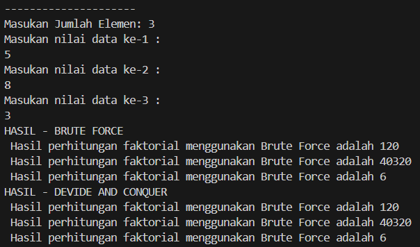
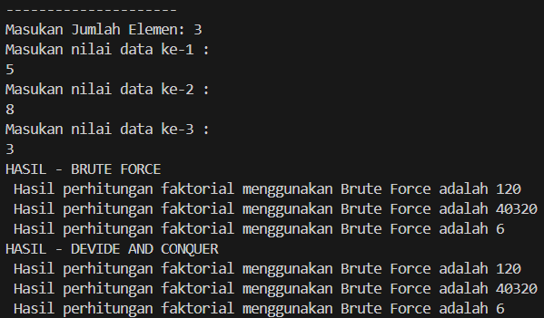
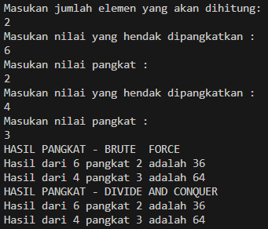

# <p align ="center"> LAPORAN PRAKTIKUM ALGORITMA DAN STRUKTUR DATA </p>

## <p align ="center"> PERTEMUAN IV <br> BRUTE FORCE DAN DIVIDE CONQUER </p>

<br><br><br><br>

<p align="center">
    </p>

<br><br><br><br><br>

<p align = "center"> Nama  : Farhan Mawaludin </p>
<p align = "center"> NIM   : 2341720258 </p>
<p align = "center"> Prodi : TEKNIK INFORMATIKA</p>
<p align = "center"> Kelas : 1B </p>
<br><br>

## 4.2 Menghitung Nilai Faktorial dengan Algoritma Brute Force dan Divide and Conquer

<b>kode class</b>
<br>

```java
package Pertemuan5;

public class faktorial11 {
    public int nilai;

    int faktorialBF(int n){
        int fakto = 1;
        for ( int i = 1 ; i <=n ; i++ ){
        fakto = fakto * i;
        }
        return fakto;
    }

    int faktorialDC(int n){
        if (n==1){
            return 1;
        }else {
            int fakto = n * faktorialDC(n-1);
            return fakto;
        }
    }
}
```

<b>kode Main</b>
<br>

```java
package Pertemuan5;

import java.util.Scanner;
public class MainFaktorial11 {
    public static void main(String[] args) {

        Scanner input11 = new Scanner(System.in);
        System.out.println("---------------------");
        System.out.print("Masukan Jumlah Elemen: ");
        int ijml = input11 . nextInt();

        faktorial11[] fk = new faktorial11[ijml];
        for (int i = 0 ; i < fk.length ; i++){
            fk[i]= new faktorial11();
            System.out.println("Masukan nilai data ke-" +(i+1) + " :");
            fk[i].nilai = input11.nextInt();

        }

        System.out.println("HASIL - BRUTE FORCE");
        for (int i = 0; i < fk.length
        ; i++){
            System.out.println(" Hasil perhitungan faktorial menggunakan Brute Force adalah " + fk[i].faktorialBF(fk[i].nilai));
        }

        System.out.println("HASIL - DEVIDE AND CONQUER");
        for (int i = 0; i < fk.length
        ; i++){
            System.out.println(" Hasil perhitungan faktorial menggunakan Brute Force adalah " + fk[i].faktorialDC(fk[i].nilai));
        }

    }

}
```

<b>Output Kode</b><br>



### 4.2.3 Pertanyaan

1. Pada base line Algoritma Divide Conquer untuk melakukan pencarian nilai faktorial, jelaskan
   perbedaan bagian kode pada penggunaan if dan else!<br>
   Jawab : penggunaan if disini sebagai base case jadi jika saat di cek n=1 maka akan berhenti da mereturnkan 1, tapi else disini sebgai fungsi rekursif ketika pada saaat n tidak sama dengan 1 maka akan dieksekusi sampai nilai n kembali kepada base case.
2. Apakah memungkinkan perulangan pada method faktorialBF() dirubah selain menggunakan
   for?Buktikan! <br>
   Jawab : bisa menggunakan rekursif<br>
   kode
   ```java
   int faktorialBF(int n) {
        if (n == 0 || n == 1) {
            return 1;
        } else {
            return n * faktorialBF(n - 1);
        }
    }
   ```
   <br> output
   
3. Jelaskan perbedaan antara fakto _= i; dan int fakto = n _ faktorialDC(n-1); !<br>
   Jawab : fakto _=i itu menghitung secara langsung mengalikan sampai bilangan ke n sedangkan fakto = n _ faktorialDC(n-1) memanggil fungsi itu sendiri untuk menghitung nilai faktorial secara berulang hingga mencapai kasus dasar.

## 4.3 Menghitung Hasil Pangkat dengan Algoritma Brute Force dan Divide and Conquer

<b>kode class</b>
<br>

```java
package Pertemuan5;

public class pangkat11 {
    public int nilai;
    public int pangkat;

    int pangkatBF(int a, int n){
        int hasil = 1;
        for (int i = 0; i <n ; i++){
            hasil = hasil * a;
        }return hasil;
    }
    int pangkatDC(int a, int n){
        if (n == 0){
            return 1;
        }else{
            if(n%2==1){
                return (pangkatDC(a, n/2) * pangkatDC(a, n/2)*a);
            }else {
                return (pangkatDC(a, n/2) * pangkatDC(a, n/2));
            }
        }
    }
}
```

<b>kode Main</b>
<br>

```java
package Pertemuan5;
import java.util.Scanner;
public class MainPangkat11 {
    public static void main(String[] args) {
        Scanner input11 = new Scanner(System.in);
        System.out.println("Masukan jumlah elemen yang akan dihitung: ");
        int elemen = input11.nextInt();

        pangkat11[] png = new pangkat11[elemen];
        for  (int i=0 ;i<png.length;i++){
            png[i] = new pangkat11();
            System.out.println("Masukan nilai yang hendak dipangkatkan : ");
            png[i].nilai=input11.nextInt();
            System.out.println("Masukan nilai pangkat : ");
            png[i].pangkat=input11.nextInt();
        }

        System.out.println("HASIL PANGKAT - BRUTE  FORCE");
        for (int i = 0 ; i<png.length; i++){
            System.out.println("Hasil dari " + png[i].nilai + " pangkat " + png[i].pangkat + " adalah " + png[i].pangkatBF(png[i].nilai, png[i].pangkat) );
        }

        System.out.println("HASIL PANGKAT - DIVIDE AND CONQUER");
        for (int i = 0 ; i<png.length; i++){
            System.out.println("Hasil dari " + png[i].nilai + " pangkat " + png[i].pangkat + " adalah " + png[i].pangkatDC(png[i].nilai, png[i].pangkat) );
        }
    }
}
```

<b>Output</b>
<br>



### 4.3.3 Pertanyaan

1. Jelaskan mengenai perbedaan 2 method yang dibuat yaitu PangkatBF() dan PangkatDC()! <br>
   Jawab : method pangkatBF() penrhitungan secara iteratif dimana dia dikalikan sebanyak jumlah dirinya sedniri menggunakan loop sedangan PangkatDC() menguunakan perhitungan secara rekursif dimana nilai n akan dihitung terus selama belum mencapai dari base casenya.
2. Apakah tahap combine sudah termasuk dalam kode tersebut?Tunjukkan!<br>
   Jawab : sudah ada pada tahap pangkatDC() yaitu pada<br>

```java
            if(n%2==1){
                return (pangkatDC(a, n/2) * pangkatDC(a, n/2)*a);
            }else {
                return (pangkatDC(a, n/2) * pangkatDC(a, n/2));
            }
```

3. Modifikasi kode program tersebut, anggap proses pengisian atribut dilakukan dengan konstruktor.<br>
   Jawab : konstruktor <br>
   ```java
   public pangkat11(int a, int n) {
        this.nilai = a;
        this.pangkat = n;
    }
   ```
   <br>main<br>
   ```java
   pangkat11[] png = new pangkat11[elemen];
       for (int i = 0; i < png.length; i++) {
           System.out.println("Masukkan nilai yang hendak dipangkatkan: ");
           int a = input11.nextInt();
           System.out.println("Masukkan nilai pangkat: ");
           int n = input11.nextInt();
           png[i] = new pangkat11(a, n);
       }
   ```
4. Tambahkan menu agar salah satu method yang terpilih saja yang akan dijalankan menggunakan switch-case!<br>
   Jawab : modifikasi<br>

   ```java
   System.out.println("Pilih metode perhitungan pangkat:");
        System.out.println("1. Brute Force");
        System.out.println("2. Divide and Conquer");
        System.out.print("Masukan Pilihan :");
        int pilihan = input11.nextInt();

        switch (pilihan) {
            case 1:
                System.out.println("HASIL PANGKAT - BRUTE FORCE");
                for (int i = 0; i < png.length; i++) {
                    System.out.println("Hasil dari " + png[i].nilai + " pangkat " + png[i].pangkat + " adalah " + png[i].pangkatBF());
                }
                break;
            case 2:
                System.out.println("HASIL PANGKAT - DIVIDE AND CONQUER");
                for (int i = 0; i < png.length; i++) {
                    System.out.println("Hasil dari " + png[i].nilai + " pangkat " + png[i].pangkat + " adalah " + png[i].pangkatDC());
                }
                break;
            default:
                System.out.println("Pilihan tidak valid");
                break;
        }
   ```

```

```
