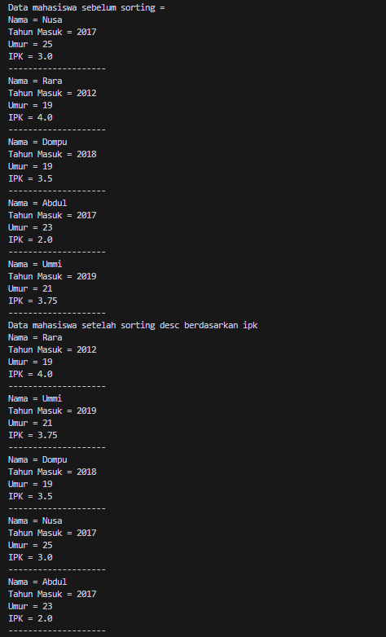
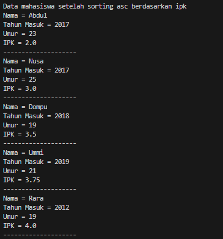
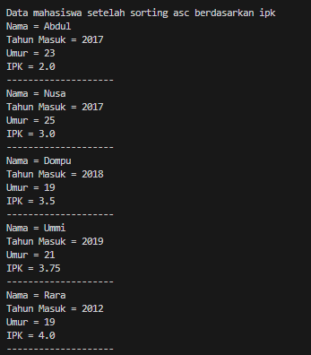
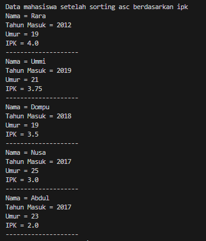
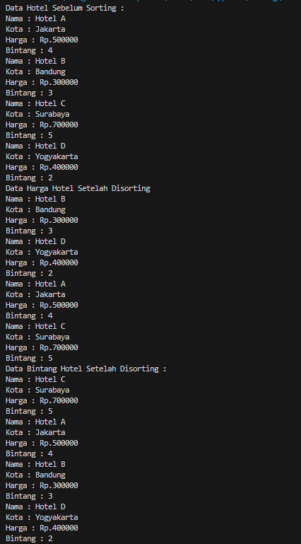

# <p align ="center"> LAPORAN PRAKTIKUM ALGORITMA DAN STRUKTUR DATA </p>

## <p align ="center"> PERTEMUAN VI <br> SORTING (BUBBLE, SELECTION, DAN INSERTION SORT) </p>

<br><br><br><br>

<p align="center">
    </p>

<br><br><br><br><br>

<p align = "center"> Nama  : Farhan Mawaludin </p>
<p align = "center"> NIM   : 2341720258 </p>
<p align = "center"> Prodi : TEKNIK INFORMATIKA</p>
<p align = "center"> Kelas : 1B </p>
<br><br>

# 5.2 Mengurutkan Data Mahasiswa Berdasarkan IPK Menggunakan Bubble Sort

<b>Kode Class Mahasiwaa11</b>
<br>

```java
public class Mahasiswaa11 {
    String nama;
    int thnMasuk;
    int umur;
    double  ipk;

    Mahasiswaa11(String n, int t, int u, double i){
        nama = n;
        thnMasuk=t;
        umur=u;
        ipk = i;
    }

    void tampil(){
        System.out.println("Nama = "+nama);
        System.out.println("Tahun Masuk = "+thnMasuk);
        System.out.println("Umur = "+umur);
        System.out.println("IPK = "+ipk);
    }
}
```

<br>
<b>Kode class DaftarMahasiswaBerprestasi11</b>
<br>

```java
import Pertemuan5.mainlatihan11;

public class DaftarMahasiswaBerprestasi11 {
    Mahasiswaa11 [] listMhs = new Mahasiswaa11[5];
    int idx;

    void tambah(Mahasiswaa11 m){
        if(idx < listMhs.length){
            listMhs[idx] = m;
            idx++;
        }else{
            System.out.println("Data sudah penuh!");
        }
    }

    void tampil(){
        for ( Mahasiswaa11 m : listMhs){
            m.tampil();
            System.out.println("--------------------");
        }
    }

    void bubbleSort() {
        for (int i = 0; i < listMhs.length; i++) {
            for (int j = 1; j < listMhs.length; j++) {

                if (listMhs[j].ipk > listMhs[j - 1].ipk) {
                    Mahasiswaa11 tmp = listMhs[j];
                    listMhs[j] = listMhs[j - 1];
                    listMhs[j - 1] = tmp;
                }
            }
    }
}
}
```

<br>
<b>Kode class mainMahasiswa</b>
<br>

```java
public class mainMahasiswa11 {
    public static void main(String[] args) {
        DaftarMahasiswaBerprestasi11 list = new DaftarMahasiswaBerprestasi11();

        Mahasiswaa11 m1 = new Mahasiswaa11("Nusa",2017,25,3);
        Mahasiswaa11 m2 = new Mahasiswaa11("Rara", 2012, 19, 4);
        Mahasiswaa11 m3 = new Mahasiswaa11("Dompu", 2018, 19, 3.5);
        Mahasiswaa11 m4 = new Mahasiswaa11("Abdul", 2017, 23, 2);
        Mahasiswaa11 m5 = new Mahasiswaa11("Ummi", 2019, 21, 3.75);

        list.tambah(m1);
        list.tambah(m2);
        list.tambah(m3);
        list.tambah(m4);
        list.tambah(m5);

        System.out.println("Data mahasiswa sebelum sorting = ");
        list.tampil();

        System.out.println("Data mahasiswa setelah sorting desc berdasarkan ipk");
        list.bubbleSort();
        list.tampil();

    }
}
```

<br>
<b>Output</b>
<br>



## 5.2.3 Pertanyaan

1. Terdapat di method apakah proses bubble sort? <br>
   Jawab : bubbleSort() <br>
2. Di dalam method bubbleSort(), terdapat baris program seperti di bawah ini: Untuk apakah proses tersebut? <br>
   Jawab : untuk memastikansupaya elemen diurutkan secara descending <br>
3. Perhatikan perulangan di dalam bubbleSort() di bawah ini: <br>
   a. Apakah perbedaan antara kegunaan perulangan i dan perulangan j? <br>
   Jawab : perulangan i digunakan untuk melihat seluruh array untuk setiap iterasi dari luar ke dalam, sedangkan perulangan j digunakan untuk membandingkan elemen-elemen berdekatan untuk setiap iterasi<br>
   b. Mengapa syarat dari perulangan i adalah i listMhs.length-1 ?
   <br> Jawab : karena pada setiap iterasi dari luar ke dalam, elemen terbesar akan berpindah atau bergeser ke posisi yang benar. <br>
   c. Mengapa syarat dari perulangan j adalah j listMhs.length-i ? <br>
   Jawab : karena setiap iterasi i sudah memastikan bahwa elemen terbesar berada di posisi yang benar<br>
   d. Jika banyak data di dalam listMhs adalah 50, maka berapakali perulangan i akan berlangsung? Dan ada berapa Tahap bubble sort yang ditempuh? <br>
   Jawab : 49 kali

   # 5.3 Mengurutkan Data Mahasiswa Berdasarkan IPK Menggunakan Selection Sort

   <b>Kode Program</b>
   <br>

```java
void selectionSort(){
            for (int i = 0; i < listMhs.length; i++) {
                int minIndex = i;
                for (int j = i + 1; j < listMhs.length; j++) {
                    if (listMhs[j].ipk < listMhs[minIndex].ipk) {
                        minIndex = j;
                    }
                }

                Mahasiswaa11 tmp = listMhs[minIndex];
                listMhs[minIndex] = listMhs[i];
                listMhs[i] = tmp;
            }
    }
```

<b>Output</b>
<br>



## 5.3.3. Pertanyaan

1. Di dalam method selection sort, terdapat baris program seperti di bawah ini: <br>

```java
int idxMin = i;
                for (int j = i + 1; j < listMhs.length; j++) {
                    if (listMhs[j].ipk < listMhs[idxMin].ipk) {
                        idxMin = j;
                    }
                }
```

Untuk apakah proses tersebut, jelaskan! <br>
Jawab : untuk mencari elemen terkecil dalam sisa array yang belum diurutkan. Selama proses iterasi, jika ditemukan elemen yang lebih kecil dari elemen terkecil saat ini, maka indeks elemen terkecil akan diperbarui. Setelah iterasi selesai, elemen terkecil akan ditukar dengan elemen pertama pada sisa array yang belum diurutkan, sehingga elemen terkecil akan berada pada posisi yang benar

# 5.4 Mengurutkan Data Mahasiswa Berdasarkan IPK Menggunakan Insertion Sort

<b>Kode Program</b>
<br>

```java
void insertionSort(){
        for (int i = 1 ; i < listMhs.length ; i++){
            Mahasiswaa11 temp = listMhs[i];
            int j = i;
            while (j>0 && listMhs[j-1].ipk > temp.ipk){
                listMhs[j] = listMhs[j-1];
                j--;
            }
            listMhs[j] = temp;
        }
    }
```

<b>Output</b>
<br>



## 5.4.3 Pertanyaan

1. Ubahlah fungsi pada InsertionSort sehingga fungsi ini dapat melaksanakan proses sorting dengan cara descending. <br>
   Jawab : <br>

```java
void insertionSort(){
        for (int i = 1 ; i < listMhs.length ; i++){
            Mahasiswaa11 temp = listMhs[i];
            int j = i;
            while (j>0 && listMhs[j-1].ipk < temp.ipk){
                listMhs[j] = listMhs[j-1];
                j--;
            }
            listMhs[j] = temp;
        }
    }
```



# 5.5 Latihan Praktikum

<b>Kode Class Hotel</b>
<br>

```java
public class Hotel11 {
    String nama;
    String kota;
    int harga;
    byte bintang;


    Hotel11(String n, String k, int h, Byte b){
        nama = n;
        kota = k;
        harga = h;
        bintang = b;
    }

    void tampilAll(){
        System.out.println("Nama : " +nama);
        System.out.println("Kota : " +kota);
        System.out.println("Harga : Rp."+harga);
        System.out.println("Bintang : " +bintang);

    }
}
```

<br>
<b>Kode Class HotelService</b>
<br>

```java
public class HotellService11 {
    Hotel11[] rooms = new Hotel11[5];
    int idx;

    void tambah(Hotel11 h){
        if (idx < rooms.length){
            rooms[idx] = h;
            idx++;
        }else{
            System.out.println("Hotel penuh");
        }
    }

    public void tampilAll() {
        for (Hotel11 h : rooms) {
            if (h != null) {
                h.tampilAll();
            }
        }
    }

    void bubbleSort() {
        for (int i = 0; i < rooms.length - 1; i++) {
            for (int j = 0; j < rooms.length - i - 1; j++) {
                if (rooms[j] != null && rooms[j + 1] != null && rooms[j].harga > rooms[j + 1].harga) {
                    Hotel11 tmp = rooms[j];
                    rooms[j] = rooms[j + 1];
                    rooms[j + 1] = tmp;
                }
            }
        }
    }

    void selectionSort() {
        for (int i = 0; i < rooms.length - 1; i++) {
            int minIndex = i;
            for (int j = i + 1; j < rooms.length; j++) {
                if (rooms[j] != null && rooms[minIndex] != null && rooms[j].bintang > rooms[minIndex].bintang) {
                    minIndex = j;
                }
            }
            if (rooms[minIndex] != null && rooms[i] != null) {
                Hotel11 tmp = rooms[minIndex];
                rooms[minIndex] = rooms[i];
                rooms[i] = tmp;
            }
        }
    }
}
```

<br>

<b>Kode class MainHotel</b>
<br>

```java
public class MainHotel11 {
    public static void main(String[] args) {
        HotellService11 hotel = new HotellService11();

        Hotel11 h1 = new Hotel11("Hotel A", "Jakarta", 500000, (byte) 4);
        Hotel11 h2 = new Hotel11("Hotel B", "Bandung", 300000, (byte) 3);
        Hotel11 h3 = new Hotel11("Hotel C", "Surabaya", 700000, (byte) 5);
        Hotel11 h4 = new Hotel11("Hotel D", "Yogyakarta", 400000, (byte)2);


        hotel.tambah(h1);
        hotel.tambah(h2);
        hotel.tambah(h3);
        hotel.tambah(h4);

        System.out.println("Data Hotel Sebelum Sorting :");
        hotel.tampilAll();

        System.out.println("Data Harga Hotel Setelah Disorting");
        hotel.bubbleSort();
        hotel.tampilAll();

        System.out.println("Data Bintang Hotel Setelah Disorting : ");
        hotel.selectionSort();
        hotel.tampilAll();
    }
}
```

<br>
<b>Output</b>
<br>


