# <p align ="center"> LAPORAN PRAKTIKUM ALGORITMA DAN STRUKTUR DATA </p>

## <p align ="center"> PERTEMUAN VII <br> SEARCHING </p>

<br><br><br><br>

<p align="center">
    </p>

<br><br><br><br><br>

<p align = "center"> Nama  : Farhan Mawaludin </p>
<p align = "center"> NIM   : 2341720258 </p>
<p align = "center"> Prodi : TEKNIK INFORMATIKA</p>
<p align = "center"> Kelas : 1B </p>
<br><br>

# 6.2 Searching / Pencarian Menggunakan Agoritma Sequential Search

<b> class Buku11 </b>
<br>

```java
package Pertemuan7;
public class Buku11{
    int kodeBuku, tahunTerbit,stok;
    String judul,pengarang;

    Buku11(int kodeBuku, String judul, int tahunTerbit, String pengarang, int stok){
        this.kodeBuku = kodeBuku;
        this.judul=judul;
        this.tahunTerbit = tahunTerbit;
        this.pengarang = pengarang;
        this.stok = stok;
    }
    public void tampilDataBuku(){
        System.out.println("==================================");
        System.out.println("Kode Buku : " + kodeBuku);
        System.out.println(" Judul Buku : " + judul);
        System.out.println("Tahun Terbit : " + tahunTerbit);
        System.out.println("Pengarang : " + pengarang);
        System.out.println("Stok : " + stok);
    }
}
```

<br>
<b> class pencaarianBuku11 </b>
<br>

```java
package Pertemuan7;

public class pencarianBuku11 {
    Buku11 [] listBK = new Buku11[5];
    int idx;

    void tambahBuku( Buku11 m){
        if(idx < listBK.length){
            listBK[idx]=m;
            idx++;
        }else{
            System.out.println("Data Sudah Penuh");
        }
    }

    public void tampilDataBuku(){
        for (Buku11 m : listBK){
            m.tampilDataBuku();
        }
    }

    public int FindSeqSearch(int cari){
        int posisi = 2;
        for (int j = 0 ; j <listBK.length; j++){
            if (listBK[j].kodeBuku == cari){
                return j;
            }
        }
        return -1;
    }
    public void tampilPosisi(int x, int pos){
        if ( pos != -1){
            System.out.println("Data : " + x + " ditemukan pada indeks " + pos);
        }else{
            System.out.println("Data : " + x + " tidak ditemukan");
        }
    }
}
```

<br>

<b> class BukuMain11 </b>
<br>

```java
package Pertemuan7;
import java.util.Scanner;

public class BukuMain11 {
    public static void main(String[] args) {
        Scanner s = new Scanner (System.in);
        Scanner s1 = new Scanner (System.in);

        pencarianBuku11 data = new pencarianBuku11() ;
        int jumBuku = 5;

        System.out.println("---------------------------------------");
        System.out.println("Masukan data buku secara urut dari kode buku terkecil : ");
        for (int i=0;i<jumBuku;i++) {
            System.out.println("---------------------");
            System.out.print("Kode Buku : ");
            int kodeBuku = s.nextInt();
            System.out.print("Judul  Buku : ");
            String judulBuku = s1.nextLine();
            System.out.print("Tahun Terbit : ");
            int tahunTerbit = s.nextInt();
            System.out.print("Pengarang : ");
            String pengarang = s1.nextLine();
            System.out.print("stok : ");
            int stok = s.nextInt();

            Buku11 m = new Buku11(kodeBuku, judulBuku, tahunTerbit, pengarang, stok);
            data.tambahBuku(m);
        }

        System.out.println("---------------------------------------");
        System.out.println(" Data Keseluruhan Buku : ");
        data.tampilDataBuku();


        System.out.println("---------------------------------------");
        System.out.println("---------------------------------------");
        System.out.println(" Pencarian Data : ");
        System.out.println("Masukan Kode BUku yang dicari : ");
        System.out.print("Kode Buku : ");
        int cari = s.nextInt();
        System.out.println("Menggunakan Sequential Search");
        int posisi = data.FindSeqSearch(cari);
        data.tampilPosisi(cari, posisi);


    }
}
```

<b> Output </b>
<br>

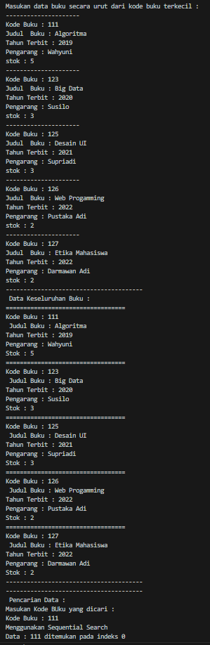

<b> Tambahan Method TampilData </b>
<br>

```java
public void TampilData (int x, int pos){
        if (pos != -1){
            System.out.println("Kode Buku : " + x);
            System.out.println(" Judul : " + listBK[pos].judul);
            System.out.println("Tahun Terbit : " + listBK[pos].tahunTerbit);
            System.out.println("Pengarang : " + listBK[pos].pengarang);
            System.out.println("Stok : " + listBK[pos].stok);
        }else {
            System.out.println("Data " + x + " tidak ditemukan!!");
        }
    }
```

```java
System.out.println("---------------------------------------");
        System.out.println("---------------------------------------");
        data.TampilData(cari, posisi);
```

<br>
<b> Output </b>
<br>

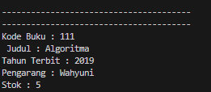 <br>
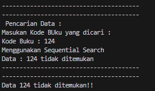

## 6.2.3. Pertanyaan

1. Jelaskan fungsi break yang ada pada method FindSeqSearch! <br>
   Jawab : untuk menghentikan looping jika data yang dicari sudah ditemukan
2. Jika Data Kode Buku yang dimasukkan tidak terurut dari kecil ke besar. Apakah program masih dapat berjalan? Apakah hasil yang dikeluarkan benar? Tunjukkan hasil screenshoot untuk bukti dengan kode Buku yang acak. Jelaskan Mengapa hal tersebut bisa terjadi? <br>
   Jawab : Program masih dapat dijalankan, Hasilnya benar.<br>
   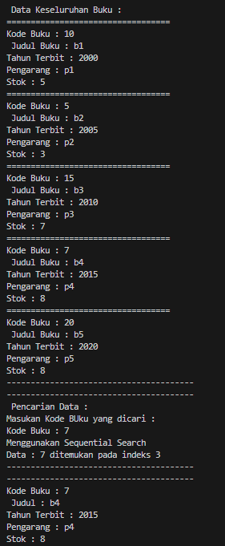
3. Buat method baru dengan nama FindBuku menggunakan konsep sequential search dengan tipe method dari FindBuku adalah BukuNoAbsen. Sehingga Anda bisa memanggil method tersebut pada class BukuMain seperti gambar berikut : <br>
   Jawab :<br>
   <b>kode findbuku </b><br>

```java
   public Buku11 FindBuku(int cari) {
    for (int j = 0; j < listBK.length; j++) {
        if (listBK[j].kodeBuku == cari) {
            return listBK[j];
        }
    }
    return null;
}
```

```java
Buku11 dataBuku11 = data.FindBuku(cari);
        dataBuku11.tampilDataBuku();
```

<br>
 <b>Output </b><br>
 
 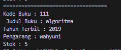

# 6.3 Searching / Pencarian Menggunakan Binary Search

<b> Tambahan Method FindBinarySearch </b>
<br>

```java
public int FindBinarySearch(int cari, int left, int right){
        int mid;
        if (right >= left){
            mid = left + (right - left) / 2;
            if ( cari == listBK[mid].kodeBuku){
                return mid;
            }else if (listBK[mid].kodeBuku > cari){
                return FindBinarySearch(cari, left, mid -1);
            }else {
                return FindBinarySearch (cari, mid +1, right);
            }
        }
        return -1;
    }
```

<br>
<b> Output Method FindBinarySearch </b>
<br>

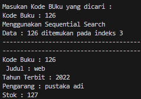<br>
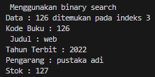

## 6.3.3. Pertanyaan

1. Tunjukkan pada kode program yang mana proses divide dijalankan! <br>
   Jawab :<br>

```java
mid = left + (right - left) / 2;
```

2. Tunjukkan pada kode program yang mana proses conquer dijalankan! <br>
   Jawab :<br>

```java
return FindBinarySearch(cari, left, mid -1);
```

<br> dan

```java
return FindBinarySearch (cari, mid +1, right);
```

3. Jika data Kode Buku yang dimasukkan tidak urut. Apakah program masih dapat berjalan? Mengapa demikian! Tunjukkan hasil screenshoot untuk bukti dengan kode Buku yang acak. Jelaskan Mengapa hal tersebut bisa terjadi? <br>
   Jawab : jika kode tidak urut program masih dapat berjalan, kode acak <br>
   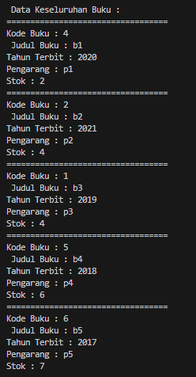 <br> output yang dihasilkan adalah 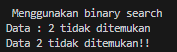 itu bisa terjadi karena data yang diinputkan tidak urut.
4. Jika Kode Buku yang dimasukkan dari Kode Buku terbesar ke terkecil (missal : 20215, 20214, 20212, 20211, 20210) dan elemen yang dicari adalah 20210. Bagaimana hasil dari binary search? Apakah sesuai? Jika tidak sesuai maka ubahlah kode program binary seach agar hasilnya sesuai! <br>
   Jawab : Hasil Binary Search tidak akan sesuai karna kode buku dari terbesar ke terkecil. sehingga proses perbandingannya harus diubah.<br>
   Hasil Modifikasi<br>

   ```java
   public int FindBinarySearch(int cari, int left, int right){
        int mid;
        if (right >= left){
            mid = left + (right - left) / 2;
            if ( cari == listBK[mid].kodeBuku){
                return mid;
            }else if (listBK[mid].kodeBuku < cari){
                return FindBinarySearch(cari, left, mid -1);
            }else {
                return FindBinarySearch (cari, mid +1, right);
            }
        }
        return -1;
    }
   ```

    <br>
    Output<br>

   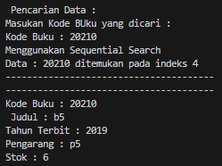 <br>

   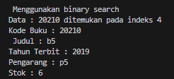

# 6.4. Percobaan Pengayaan Divide and Conquer

<b> class MergeSorting11 </b>
<br>

```java
public class MergeSorting11 {
    public void mergeSort(int[] data){
        sort (data, 0 , data.length -1);
    }

    public void merge(int data[], int left, int middle, int right) {
        int[] temp = new int[data.length];
        for (int i = left; i <= right; i++) {
            temp[i] = data[i];
        }
        int a = left;
        int b = middle + 1;
        int c = left;

        while (a <= middle && b <= right) {
            if(temp[a] <= temp[b]) {
                data[c] = temp[a];
                a++;
            } else {
                data[c] = temp[b];
                b++;
            }
            c++;
        }
        int s = middle - a;
        for (int i=0; i<= s; i++) {
            data[c + i] = temp[a + i];
        }
    }

    public void sort(int data[], int left, int right) {
        if (left < right) {
            int middle = (left + right) / 2;
            sort(data, left, middle);
            sort(data, middle + 1, right);
            merge(data, left, middle, right);
        }
    }

    public void printArray(int arr[]) {
        for(int i = 0; i<arr.length; i++) {
            System.out.print(arr[i] + " ");
        }
        System.out.println();
    }
}
```

<br>
<b> class MergeSortingMain11 </b>
<br>

```java
public class MergeSortingMain11 {
    public static void main(String[] args) {
        int data[] = {10,40,30,50,70,20,100,90};
        System.out.println("Sorting dengan merge sort");
        MergeSorting11 mSort = new MergeSorting11();
        System.out.println("Data awal");
        mSort.printArray(data);
        mSort.mergeSort(data);
        System.out.println("Setelah diurutkan");
        mSort.printArray(data);
    }
}
```

<br>

<b> Output </b>
<br>

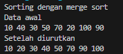
