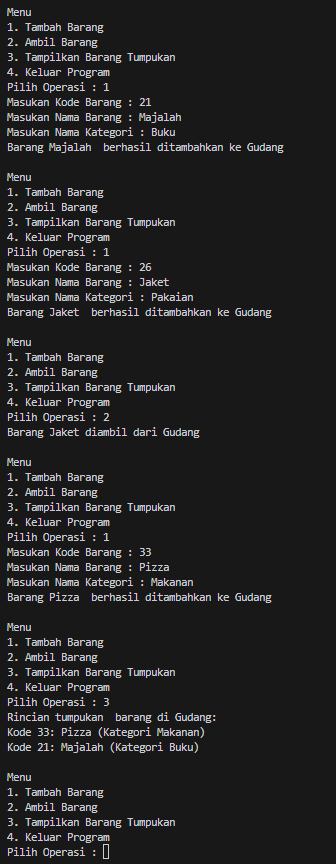

# <p align ="center"> LAPORAN PRAKTIKUM ALGORITMA DAN STRUKTUR DATA </p>

## <p align ="center"> PERTEMUAN VIII <br> STACK </p>

<br><br><br><br>

<p align="center">
    </p>

<br><br><br><br><br>

<p align = "center"> Nama  : Farhan Mawaludin </p>
<p align = "center"> NIM   : 2341720258 </p>
<p align = "center"> Prodi : TEKNIK INFORMATIKA</p>
<p align = "center"> Kelas : 1B </p>
<br><br>

# 2.1 Percobaan 1: Penyimpanan Tumpukan Barang dalam Gudang

<b> Kode Barang11 </b>
<br>

```java
package Pertemuan8;

public class Barang11 {
    int kode;
    String nama;
    String kategori;

    Barang11(int kode, String nama, String kategori){
        this.kode = kode;
        this.nama = nama;
        this.kategori = kategori;
    }
}
```

<br>
<b> Kode Gudang11 </b>
<br>

```java
package Pertemuan8;

public class Gudang11 {

    Barang11[] tumpukan;
    int size;
    int top;

    public Gudang11(int kapasitas){
        size = kapasitas;
        tumpukan  = new Barang11[size];
        top = -1;
    }

    public boolean cekKosong(){
        if(top == -1){
            return true;
        }else{
            return false;
        }
    }

    public boolean cekPenuh(){
        if ( top == size -1){
            return true;
        }else{
            return false;
        }
    }

    public void tambahBarang(Barang11 brg){
        if (!cekPenuh()){
            top++;
            tumpukan[top] = brg;
            System.out.println("Barang " + brg.nama + "  berhasil ditambahkan ke Gudang");
        }else {
            System.out.println("Gagal!! Tumpukan barang di Gudang sudah Penuh");
        }
    }

    public Barang11 ambilBarang(){
        if(!cekKosong()){
            Barang11 delete = tumpukan[top];
            top--;
            System.out.println("Barang " + delete.nama + " diambil dari Gudang");
            return delete;
        }else{
            System.out.println("Tumpukan barang kosong");
            return null;
        }
    }

    public Barang11 lihatBarangTeratas(){
        if(!cekKosong()){
            Barang11 barangTeratas = tumpukan[top];
            System.out.println("Barang Teratas: " + barangTeratas.nama);
            return barangTeratas;
        }else{
            System.out.println("Tumpukan Barang kosong");
            return null;
        }
    }

    public void tampilBarang(){
        if (!cekKosong()){
            System.out.println("Rincian tumpukan  barang di Gudang:");
            for(int i = top; i >= 0; i--){
                System.out.printf("Kode %d: %s (Kategori %s)\n", tumpukan[i].kode, tumpukan[i].nama, tumpukan[i].kategori);
            }
        }else {
            System.out.println("Tumpukan Barang Kosong");
        }
    }
}
```

<br>
<b> Kode Utama11 </b>
<br>

```java
package Pertemuan8;
import java.util. Scanner;

import Pertemuan3.code.segitiga11;
public class Utama11 {
    public static void main(String[] args) {
        Gudang11 gudang = new Gudang11(7);
        Scanner input11 = new Scanner(System.in);

        while(true){
            System.out.println("\nMenu");
            System.out.println("1. Tambah Barang");
            System.out.println("2. Ambil Barang");
            System.out.println("3. Tampilkan Barang Tumpukan");
            System.out.println( "4. Keluar Program");
            System.out.print("Pilih Operasi : ");
            int pilihan = input11.nextInt();

            switch (pilihan){
                case 1 :
                System.out.print("Masukan Kode Barang : ");
                int kode = input11.nextInt();
                System.out.print("Masukan Nama Barang : ");
                String nama = input11.next();
                System.out.print("Masukan Nama Kategori : ");
                String kategori = input11.next();
                Barang11 barangBaru = new Barang11(kode, nama, kategori);
                gudang.tambahBarang(barangBaru);
                 break;

                 case 2:
                 gudang.ambilBarang();
                 break;

                 case 3:
                 gudang.tampilBarang();
                 break;

                 case 4:
                 break;

                 default:
                 System.out.println("pilihan tidak valid!!!");
            }
        }

    }

}
```

<br>
<b> Output </b>
<br>



## 2.1.3 Pertanyaan

1. Lakukan perbaikan pada kode program, sehingga keluaran yang dihasilkan sama dengan verifikasi hasil percobaan! Bagian mana saja yang perlu diperbaiki?<br>
   Jawab : gterjadi pada meethod tampilBarang() pada perulanagnnya,<br>

```java
for(int i = top; i >= 0; i--)
```

2. Berapa banyak data barang yang dapat ditampung di dalam tumpukan? Tunjukkan potongan kode programnya! <br>
   Jawab : terdapat menampung barang sebanyak 7 kapasitas.<br>

```java
Gudang11 gudang = new Gudang11(7);
```

3. Mengapa perlu pengecekan kondisi !cekKosong() pada method tampilkanBarang? Kalau kondisi tersebut dihapus, apa dampaknya? <br>
   Jawab : perlu dilakukan pengecekan kerana untuk memastikan bahwa tumpukan tidak kosong sebelum menampilkan barang.jika tumpukan kosong makan akan menampilkan pesan yang sesuai. tapi jika menghapus kondisi !cekKosong program akan menampilkan rincian barang tanpa memerikasa tumpukannya kosng atau tidak dan akan akan menyebabkan nullpointerexception jika tumpukan kosong.
4. Modifikasi kode program pada class Utama sehingga pengguna juga dapat memilih operasi lihat barang teratas, serta dapat secara bebas menentukan kapasitas gudang! <br>
   Jawab :<br>
   <b>menambahkan operasi lihat barang teratas</b><br>

   ```java
   System.out.println("\nMenu");
            System.out.println("1. Tambah Barang");
            System.out.println("2. Ambil Barang");
            System.out.println("3. Lihat Barang Teratas");
            System.out.println("4. Tampilkan Barang Tumpukan");
            System.out.println( "5. Keluar Program");
            System.out.print("Pilih Operasi : ");
            int pilihan = input11.nextInt();
   ```

    <br>
    <b>Dapat menentukan kapasitas barang</b>
    
    ``` java
    public static void main(String[] args) {
        Scanner input11 = new Scanner(System.in);
        System.out.print("Masukan Kapasitas Gudang: ");
        int kap = input11.nextInt();
        Gudang11 gudang = new Gudang11(kap);
    ```

5. Commit dan push kode program ke Github
