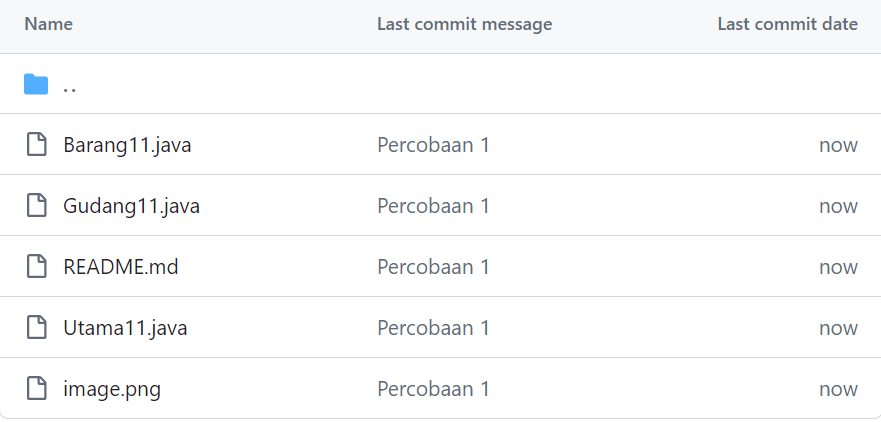
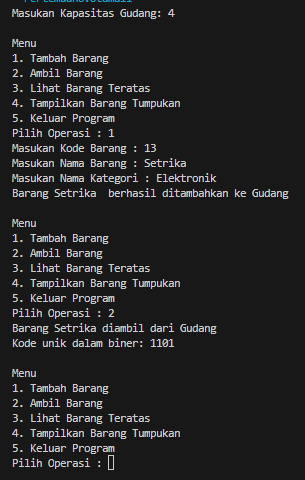
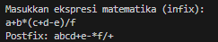
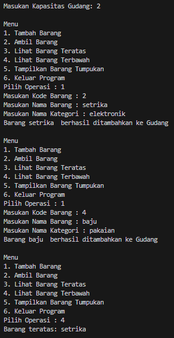
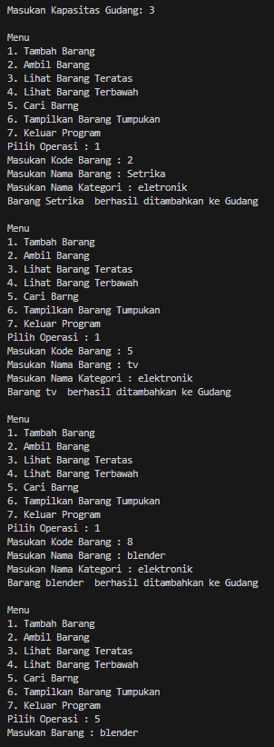
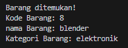

# <p align ="center"> LAPORAN PRAKTIKUM ALGORITMA DAN STRUKTUR DATA </p>

## <p align ="center"> PERTEMUAN VIII <br> STACK </p>

<br><br><br><br>

<p align="center">
    </p>

<br><br><br><br><br>

<p align = "center"> Nama  : Farhan Mawaludin </p>
<p align = "center"> NIM   : 2341720258 </p>
<p align = "center"> Prodi : TEKNIK INFORMATIKA</p>
<p align = "center"> Kelas : 1B </p>
<br><br>

# 2.1 Percobaan 1: Penyimpanan Tumpukan Barang dalam Gudang

<b> Kode Barang11 </b>
<br>

```java
package Pertemuan8;

public class Barang11 {
    int kode;
    String nama;
    String kategori;

    Barang11(int kode, String nama, String kategori){
        this.kode = kode;
        this.nama = nama;
        this.kategori = kategori;
    }
}
```

<br>
<b> Kode Gudang11 </b>
<br>

```java
package Pertemuan8;

public class Gudang11 {

    Barang11[] tumpukan;
    int size;
    int top;

    public Gudang11(int kapasitas){
        size = kapasitas;
        tumpukan  = new Barang11[size];
        top = -1;
    }

    public boolean cekKosong(){
        if(top == -1){
            return true;
        }else{
            return false;
        }
    }

    public boolean cekPenuh(){
        if ( top == size -1){
            return true;
        }else{
            return false;
        }
    }

    public void tambahBarang(Barang11 brg){
        if (!cekPenuh()){
            top++;
            tumpukan[top] = brg;
            System.out.println("Barang " + brg.nama + "  berhasil ditambahkan ke Gudang");
        }else {
            System.out.println("Gagal!! Tumpukan barang di Gudang sudah Penuh");
        }
    }

    public Barang11 ambilBarang(){
        if(!cekKosong()){
            Barang11 delete = tumpukan[top];
            top--;
            System.out.println("Barang " + delete.nama + " diambil dari Gudang");
            return delete;
        }else{
            System.out.println("Tumpukan barang kosong");
            return null;
        }
    }

    public Barang11 lihatBarangTeratas(){
        if(!cekKosong()){
            Barang11 barangTeratas = tumpukan[top];
            System.out.println("Barang Teratas: " + barangTeratas.nama);
            return barangTeratas;
        }else{
            System.out.println("Tumpukan Barang kosong");
            return null;
        }
    }

    public void tampilBarang(){
        if (!cekKosong()){
            System.out.println("Rincian tumpukan  barang di Gudang:");
            for(int i = top; i >= 0; i--){
                System.out.printf("Kode %d: %s (Kategori %s)\n", tumpukan[i].kode, tumpukan[i].nama, tumpukan[i].kategori);
            }
        }else {
            System.out.println("Tumpukan Barang Kosong");
        }
    }
}
```

<br>
<b> Kode Utama11 </b>
<br>

```java
package Pertemuan8;
import java.util. Scanner;

import Pertemuan3.code.segitiga11;
public class Utama11 {
    public static void main(String[] args) {
        Gudang11 gudang = new Gudang11(7);
        Scanner input11 = new Scanner(System.in);

        while(true){
            System.out.println("\nMenu");
            System.out.println("1. Tambah Barang");
            System.out.println("2. Ambil Barang");
            System.out.println("3. Tampilkan Barang Tumpukan");
            System.out.println( "4. Keluar Program");
            System.out.print("Pilih Operasi : ");
            int pilihan = input11.nextInt();

            switch (pilihan){
                case 1 :
                System.out.print("Masukan Kode Barang : ");
                int kode = input11.nextInt();
                System.out.print("Masukan Nama Barang : ");
                String nama = input11.next();
                System.out.print("Masukan Nama Kategori : ");
                String kategori = input11.next();
                Barang11 barangBaru = new Barang11(kode, nama, kategori);
                gudang.tambahBarang(barangBaru);
                 break;

                 case 2:
                 gudang.ambilBarang();
                 break;

                 case 3:
                 gudang.tampilBarang();
                 break;

                 case 4:
                 break;

                 default:
                 System.out.println("pilihan tidak valid!!!");
            }
        }

    }

}
```

<br>
<b> Output </b>
<br>


## 2.1.3 Pertanyaan

1. Lakukan perbaikan pada kode program, sehingga keluaran yang dihasilkan sama dengan verifikasi hasil percobaan! Bagian mana saja yang perlu diperbaiki?<br>
   Jawab : gterjadi pada meethod tampilBarang() pada perulanagnnya,<br>

```java
for(int i = top; i >= 0; i--)
```

2. Berapa banyak data barang yang dapat ditampung di dalam tumpukan? Tunjukkan potongan kode programnya! <br>
   Jawab : terdapat menampung barang sebanyak 7 kapasitas.<br>

```java
Gudang11 gudang = new Gudang11(7);
```

3. Mengapa perlu pengecekan kondisi !cekKosong() pada method tampilkanBarang? Kalau kondisi tersebut dihapus, apa dampaknya? <br>
   Jawab : perlu dilakukan pengecekan kerana untuk memastikan bahwa tumpukan tidak kosong sebelum menampilkan barang.jika tumpukan kosong makan akan menampilkan pesan yang sesuai. tapi jika menghapus kondisi !cekKosong program akan menampilkan rincian barang tanpa memerikasa tumpukannya kosng atau tidak dan akan akan menyebabkan nullpointerexception jika tumpukan kosong.
4. Modifikasi kode program pada class Utama sehingga pengguna juga dapat memilih operasi lihat barang teratas, serta dapat secara bebas menentukan kapasitas gudang! <br>
   Jawab :<br>
   <b>menambahkan operasi lihat barang teratas</b><br>

   ```java
   System.out.println("\nMenu");
            System.out.println("1. Tambah Barang");
            System.out.println("2. Ambil Barang");
            System.out.println("3. Lihat Barang Teratas");
            System.out.println("4. Tampilkan Barang Tumpukan");
            System.out.println( "5. Keluar Program");
            System.out.print("Pilih Operasi : ");
            int pilihan = input11.nextInt();
   ```

    <br>
    <b>Dapat menentukan kapasitas barang</b>
    
    ``` java
    public static void main(String[] args) {
        Scanner input11 = new Scanner(System.in);
        System.out.print("Masukan Kapasitas Gudang: ");
        int kap = input11.nextInt();
        Gudang11 gudang = new Gudang11(kap);
    ```

5. Commit dan push kode program ke Github <br>
   Jawab : 

# 2.2 Percobaan 2: Konversi Kode Barang ke Biner

<b>Menambahkan Method KonversiDesimalKeBiner</b><br>

```java
public String konversiDesimalKeBiner(int kode){
        StackKonversi11 stack = new StackKonversi11();
        while (kode > 0) {
            int sisa = kode % 2 ;
            stack.push(sisa);
            kode = kode/ 2;
        }
        String biner = new String();
        while (!stack.isEmpty()){
            biner = biner + stack.pop();
        }
        return biner;
    }
```

<br><b> Membuat class StackKonversi</b><br>

```java
package Pertemuan8;

public class StackKonversi11 {

    int size ;
    int [] tumpukanBiner;
    int top;
    public StackKonversi11(){
        this.size = 32;
        tumpukanBiner = new int[size];
        top = -1;
    }

    public boolean isEmpty(){
        return top == -1;
    }

    public boolean isFull(){
        return top == size-1;
    }

    public void push(int data){
        if(isFull()){
            System.out.println("Stack Penuh");
        }else {
            top++;
            tumpukanBiner[top]= data;
        }
    }

    public int pop(){
        if (isEmpty()) {
            System.out.println("Stack Kosong");
            return -1;
        }else {
            int data = tumpukanBiner[top] ;
            top--;
            return data;
        }
    }
}
```

<br><b>Menambahkankan baris pada method ambilBarang()</b><br>

```java
System.out.println("Kode unik dalam biner: " + konversiDesimalKeBiner(delete.kode));
```

<br><b> Output </b><br>



## 2.2.3 Pertanyaan

1. Pada method konversiDesimalKeBiner, ubah kondisi perulangan menjadi while (kode != 0), bagaimana hasilnya? Jelaskan alasannya! <br>
   Jawab : Hasilnya sama jika kondisi while dirubah, karena maksud dari kedua kondisi sama dimana kode tidak boleh bernilai nol. tapi jika menggunakan <b>!=0</b> jika kode barangnya negatif kode binernya tetap keluar tetapi jika menggunakan <b> > 0 </b> saat kode barangnya negatif kode binernya tidaak keluar.
2. Jelaskan alur kerja dari method konversiDesimalKeBiner! <br>
   Jawab : membuat inisialisasi stack untuk menyimpan sisa pembagian, kemudian bilangan desimal dibagi terus dengan 2 dan sisa pembagiannya disimpan dalam stack. setelah itu sisa pembagian tadi yang disimpan dalam stack akan diambil satu persatu dan digabungkan menjadi bilanga biner kemudian pengembalian nilai biner sebagai hasil konversi

# 2.3 Percobaan 3: Konversi Notasi Infix ke Postfix

<b> Kode Postfix11 </b><br>

```java
package Pertemuan8;

public class Postfix11 {
    int n;
    int top;
    char[] stack;

    public Postfix11 (int total){
        n = total;
        top = -1;
        stack = new char[n];
        push('(');

    }

    public void push(char c) {
        top++;
        stack[top] = c;
    }

    public char pop() {
        char item = stack[top];
        top--;
        return item;
    }

    public boolean IsOperand(char c) {
        if ((c >= 'A' && c <= 'Z') || (c >= 'a' && c <= 'z') ||
                (c >= '0' && c <= '9') || c == ' ' || c == '.') {
            return true;
        } else {
            return false;
        }
    }

    public boolean IsOperator(char c) {
        if (c == '^' || c == '%' || c == '/' || c == '*' || c == '-' || c == '+') {
            return true;
        } else {
            return false;
        }
    }

    public int derajat(char c) {
        switch (c) {
            case '^':
                return 3;
            case '%':
                return 2;
            case '/':
                return 2;
            case '*':
                return 2;
            case '-':
                return 1;
            case '+':
                return 1;
            default:
                return 0;
        }
    }

    public String konversi(String Q) {
        String P = "";
        char c;
        for (int i=0; i<n; i++) {
            c = Q.charAt(i);
            if (IsOperand(c)) {
                P = P + c;
            }
            if (c == '(') {
                push(c);
            }
            if (c == ')') {
                while (stack[top] != '(') {
                    P = P + pop();
                }
                pop();
            }
            if (IsOperator(c)) {
                while (derajat(stack[top]) >= derajat(c)) {
                    P = P + pop();
                }
                push(c);
            }
        }
        return P;
    }
}
```

<br><b> Kode PostfixMain11 </b><br>

```java
package Pertemuan8;

import java.util.Scanner;

public class PostfixMain11 {
    public static void main(String[] args) {
        Scanner sc = new Scanner(System.in);
        String P, Q;
        System.out.println("Masukkan ekspresi matematika (infix): ");
        Q = sc.nextLine();
        Q = Q.trim();
        Q = Q + ")";

        int total = Q.length();

        Postfix11 post = new Postfix11(total);
        P = post.konversi(Q);
        System.out.println("Postfix: " + P);
    }
}

```

<br><b> Output </b><br>



<br>

## 2.3.3 Pertanyaan

1. Pada method derajat, mengapa return value beberapa case bernilai sama? Apabila return value diubah dengan nilai berbeda-beda setiap case-nya, apa yang terjadi? <br>
   Jawab : return vsluenys bernilai sama karena beberpa case operatornya memeiliki prioritas yang sama.
2. Jelaskan alur kerja method konversi! <br>
   Jawab : Iterasi melalui setiap karakter dalam ekspresi infix.
   Jika karakter adalah operand, tambahkan ke ekspresi postfix.
   Jika karakter adalah '(' (kurung buka), dorong ke dalam stack.
   Jika karakter adalah ')' (kurung tutup), pop operator dari stack dan tambahkan ke ekspresi postfix hingga ditemukan '(' (kurung buka).
   Jika karakter adalah operator, pop operator-operator dengan prioritas yang lebih tinggi atau sama dari stack dan tambahkan ke ekspresi postfix, kemudian dorong operator saat ini ke dalam stack
3. Pada method konversi, apa fungsi dari potongan kode berikut? <br>

```java
 c = Q.charAt(i);
```

Jawab : digunakan untuk mengambil karakter pada posisi indeks i dari string Q, yang merupakan ekspresi infix yang akan dikonversi menjadi postfix

# 2.4 Latihan Praktikum

Perhatikan dan gunakan kembali kode program pada Percobaan 1. Tambahkan dua method berikut pada class Gudang:

- Method lihatBarangTerbawah digunakan untuk mengecek barang pada tumpukan terbawah<br>

```java
public Barang11 lihatBarangTerbawah() {
        if (!cekKosong()) {
            Barang11 barangTerbawah = tumpukan[0];
            System.out.println("Barang teratas: " + barangTerbawah.nama);
            return barangTerbawah;
        } else {
            System.out.println("Tumpukan barang kosong.");
            return null;
        }
    }
```

<br><b> Output</b><br>

 <br>

- Method cariBarang digunakan untuk mencari ada atau tidaknya barang berdasarkan kode barangnya atau nama barangnya<br>

```java
public void cariBarang(String key) {
        boolean ditemukan = false;

        for (int j=0; j<=top; j++) {
            try {
                int kodeKey = Integer.parseInt(key);
                if (tumpukan[j].nama.equalsIgnoreCase(key) || tumpukan[j].kode == kodeKey) {
                    System.out.println("Barang ditemukan!");
                    ditemukan = true;
                    System.out.println("Kode Barang: "+ tumpukan[j].kode);
                    System.out.println("nama Barang: "+ tumpukan[j].nama);
                    System.out.println("Kategori Barang: "+ tumpukan[j].kategori);
                    return;
                }
            } catch (NumberFormatException e) {
                System.out.println("");
                break;
            }
        }

        for (int j=0; j<=top; j++) {
            if (tumpukan[j].nama.equalsIgnoreCase(key)){
                System.out.println("Barang ditemukan!");
                System.out.println("Kode Barang: "+ tumpukan[j].kode);
                System.out.println("nama Barang: "+ tumpukan[j].nama);
                System.out.println("Kategori Barang: "+ tumpukan[j].kategori);
                return;
            } else {
                System.out.println("");
            }
        }

        if (!ditemukan) {
            System.out.println("Barang tidak ditemukan!");
        }
    }
```

<br><b> Output</b><br>

<br>

