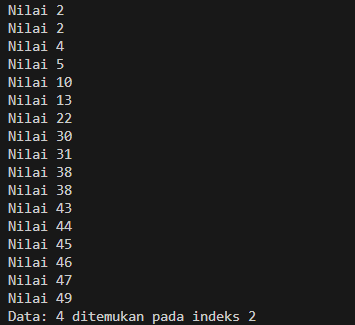

# 
 LAPORAN PRAKTIKUM ALGORITMA DAN STRUKTUR DATA 

## 
 PERTEMUAN IX   UTS 

    

    

     

 Nama  : Farhan Mawaludin 

 NIM   : 2341720258 

 Prodi : TEKNIK INFORMATIKA

 Kelas : 1B 

  

- nilai yang dapat ditemukan (ditunjukkan pada lokasi index sebelum pengurutan)  
    

- nilai yang dapat ditemukan (ditunjukkan pada lokasi index setelah pengurutan secara ascending)  
    

- nilai yang dapat ditemukan (ditunjukkan pada lokasi index setelah pengurutan secara descending 
    

- nilai tidak ditemukan. 
  
